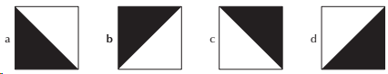
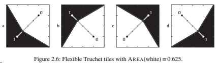

import styles from './index.module.css'
import bmw from './bmw.png'
import bmw_0 from './bmw.0.1000x1000.png'
import i4_0 from './i4.0.1200x900.png'
import i4_2 from './i4.2.1200x900.png'
import i4_5 from './i4.5.1200x900.png'
import i4_raster from './i4.50x72.png'
import i4 from './i4.png'
import dynamic_tiles from './dynamic_truchet_tiles.png'
import tiles from './truchet_tiles.png'

Isn't this BMW I4 a beauty? The perfect motivation to start a journey into a little optimization problem:

> How to manipulate traditional Truchet tiles so that the resulting tiling resembles the Ultimate Driving Machine?

Truchet tiles are a well known niche in math because they form a foundation for a lot of interesting questions.
The basic theory: You have four simple tiles:

Since every tile is 50% black and 50% white a resulting tiling can only resemble a grey area if viewed from afar.
In order to depict images it is necessary to manipulate the proportion of black vs. white.

Just envision one Truchet tile as a dot in a black-and-white rater image:

The trick is now to manipulate the tiles so that they can approximate the grey shade of a raster point.

<small>Source: Bosch, Robert. Opt Art: From Mathematical Optimization to Visual Design (p. 6). Princeton University Press.</small>
 

The black half is intersected by a diagonal: $(0,1)$. Along this line the threshold for black can be moved up and down.

$t = 0 \Leftrightarrow P(0.25, 0.25)$: maximal brightness.  
$t = 1 \Leftrightarrow P(0.75, 0.75)$: maximal darkness.

The brightness of a tile is only depending on the parameter $t \in (0, 1)$.

As a result the polygon ABPC encloses an area which is proportional to the darkness of the tile. This is a very simple
linear dependency and can be easily modelled.

If a is the length of the tile and t is our 'black' parameter, then the math is:
$$
t' = \sqrt{2} \\
y_1 = - \frac{a-t'}{t'}x + a \\
y_2 = - \frac{t'}{a-t'}x + \frac{at'}{a-t'} \\
$$

Enough theory, let's see what can be done with this simple model.

## Application of model

<!--

-->

Isn't this a beautiful combination of math, programming and design?

If you are interested in the Python code contact me via [mail](mailto:sysid@gmx.de).

