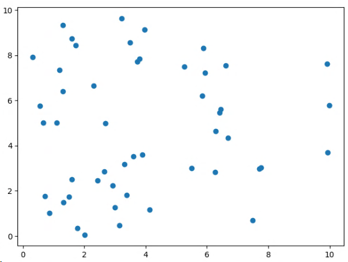
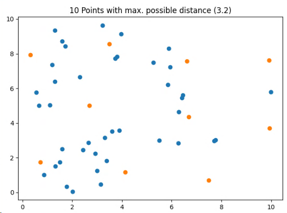

> Find 10 points out of 50 with maximum distance from each other.[^1]
 


This problem can modelled as a **max-min** model where we maximize the smallest distance of 10 points.

## Model
$$
\max \Delta\\
s.t.\\
\Delta \le d_{i,j} + M(1- x_i x_j), \forall i \lt j \\
\sum_i x_i = k\\
x_i \in \{0,1\}\\
$$

M is an upper bound on the distances:
$$
M = \max_{i\le j} d_{i,j}\\
$$

The quadratic part $x_i x_j$ of the constraint can be linearized:

$$
\Delta \le d_{i,j} + M(1-x_i x_j)\\
\Leftrightarrow\\
\Delta \le d_{i,j} + M(1-x_i) + M(1- x_j)\\
$$

## Implementation
The [Pyomo](http://www.pyomo.org/) implementation of the constraints follows the mathematical formulation closely:

```python
model.k_c = Constraint(
    model.I, rule=lambda model, i: sum(model.x[i] for i in model.I) == K
)

M = max(model.distance[i, j] for i in model.I for j in model.I if i <= j)
def delta_c(model, i, j):
    if i < j:
        return model.delta <= model.distance[i, j] + M * (1 - model.x[i] + M * (1 - model.x[j]))
    else:
        return Constraint.Skip
model.delta_c = Constraint(model.I, model.I, rule=delta_c)
```

## Result
The CBC solver has no problems with this model:

Solution: 3.2049493  
Number of constraints : 1275  
Number of variables : 51  
Duration: 00:00:03



This model ensures, that the 10 solution points are at least distanced by 3.2 units, which is the maximal possible 
common distance for 10 points of the given set of 50.

The takeaway here is the linearization of the quadratic constraint. Another trick in our belt.

 
[^1]: http://yetanothermathprogrammingconsultant.blogspot.com/2019/06/maximum-dispersion.html
