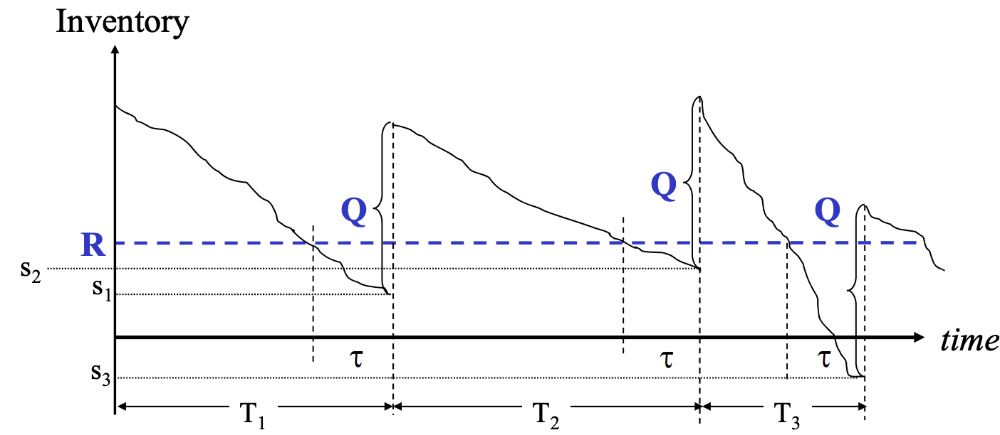
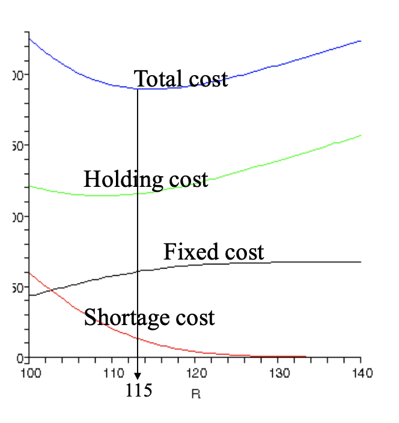
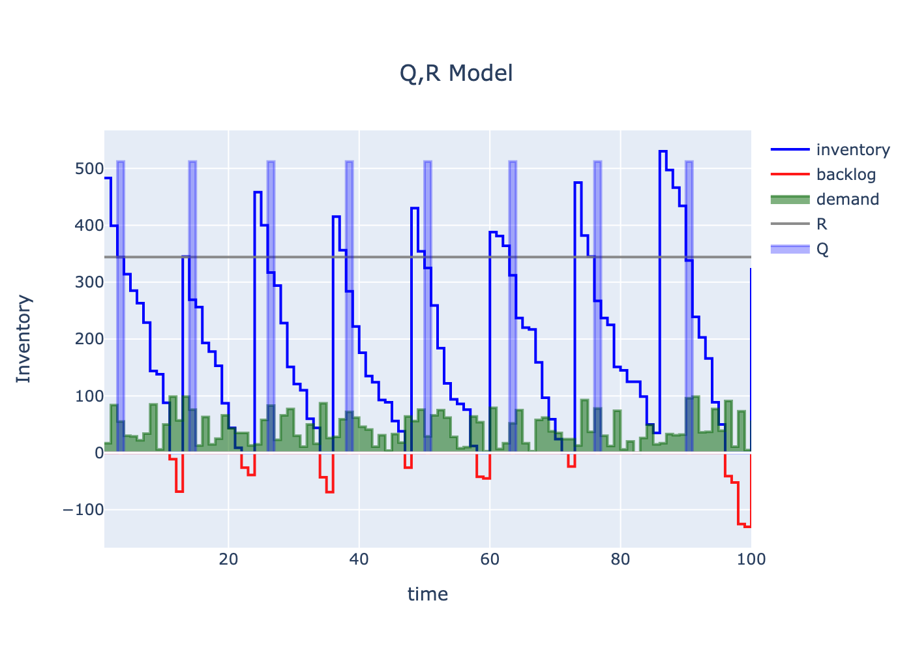

> Find the best order policy to replenish stock levels, i.e. minimize the total cost incurred.

The (Q, R) inventory model is as follows:
- If the inventory falls below threshold R, place an order of quantity Q.
- Lead times: when an order is placed it takes some time to be delivered
- When inventory becomes zero, additional demand will cause a backlog. Backlogged demand will be fulfilled when replenishments arrive but at a cost.

## Cost Contribution
1. Fixed ordering cost (Fixed cost)
2. Holding cost related to inventory (Holding cost)
3. Penalties related to backlogs (Shortage cost)



Choose quantity Q and ordering threshold R to strike a good balance among these three costs!
- To save on the shortage cost, we want large R
- To save on the holding cost, we want small Q and small R
- To save on the fixed cost, we want large Q

There are different approaches to this problem. Here we look at a Mixed Integer Programming approach.

# Model
A very accessible model description can be found here:
[Optimal (Q,R) Inventory Policy as a MIP](http://yetanothermathprogrammingconsultant.blogspot.com/2020/11/optimal-qr-inventory-policy-as-mip.html):

$$
\begin{aligned}
\min \> & z = \mathit{orderCost} \cdot \sum_t \mathit{order}_t+\mathit{holdCost} \cdot \sum_t \mathit{inv}_t+\mathit{backlogCost} \cdot\sum_t \mathit{back}_t &&  (1) \\
& \mathit{inv}_t-\mathit{back}_t = \mathit{inv}_{t-1}-\mathit{back}_{t-1} - \mathit{demand}_t + \mathit{repl}_t + \mathit{initInv}_t  && (2) \\
& \mathit{inv}_t \le \mathit{invCap} \cdot \delta_t \\
& \mathit{back}_t \le \mathit{maxBackLogged} \cdot (1-\delta_t) \\
& \mathit{inv}_t \le R + \mathit{invCap} \cdot (1-{\mathit{low}}_t ) && (3) \\
& \mathit{inv}_t \ge R + 1 - (\mathit{invCap}+1) \cdot \mathit{low}_t \\
& \mathit{order}_t \le 1-\mathit{low}_{t-1} && (4) \\
& \mathit{order}_t \le \mathit{low}_t \\
& \mathit{order}_t \ge \mathit{low}_t -\mathit{low}_{t-1} \\
& \mathit{repl}_t \le \mathit{maxQ} \cdot \mathit{order}_{t-\mathit{leadTime}} && (5) \\
& \mathit{repl}_t \le Q \\
& \mathit{repl}_t \ge  Q - \mathit{maxQ} \cdot (1-\mathit{order}_{t-\mathit{leadTime}}) \\
& Q \in [0,\mathit{maxQ}] \\
& R  \in [0,\mathit{invCap}] \\
& \mathit{inv}_t  \in [0,\mathit{invCap}]  \\
& \mathit{back}_t  \in [0,\mathit{maxBackLogged}] \\
& \delta_t  \in \{0,1\} \\
& \mathit{low}_t  \in \{0,1\} \\
& \mathit{order}_t  \in \{0,1\} \\
& \mathit{repl}_t  \in [0,\mathit{maxQ}]
\end{aligned}
$$

# Implementation
Using [Pyomo](http://www.pyomo.org/) as modelling framework results in the following Python code for the constraints.

The numbers in the code comments match the constraint numbering in the MIP model above.

```python
        # 2a inventory balance equation:
        def inv_balance_c(model, t):
            if t == 1:
                return (
                    model.inv[t] - model.backlog[t]
                    == -model.demand[t] + model.repl[t] + model.initInv[t]
                )
            return (
                model.inv[t] - model.backlog[t]
                == model.inv[t - 1]
                - model.backlog[t - 1]
                - model.demand[t]
                + model.repl[t]
                + model.initInv[t]
            )

        model.inv_balance_c = Constraint(model.H, rule=inv_balance_c)

        # 2b only one of these variables can be non-zero
        model.inv_backlog_excl_c1 = Constraint(
            model.H, rule=lambda model, t: model.inv[t] <= self.invCap * model.delta[t]
        )
        model.inv_backlog_excl_c2 = Constraint(
            model.H,
            rule=lambda model, t: model.backlog[t]
            <= self.maxBackLogged * (1 - model.delta[t]),
        )

        # 3. detect low inventory
        model.low_inv_c1 = Constraint(
            model.H,
            rule=lambda model, t: model.inv[t]
            <= model.r + self.invCap * (1 - model.low[t]),
        )
        model.low_inv_c2 = Constraint(
            model.H,
            rule=lambda model, t: model.inv[t]
            >= model.r + 1 - (self.invCap + 1) * model.low[t],
        )

        # 4. reorder event detection
        def order_event_c1(model, t):
            if t == 1:
                return Constraint.Skip
            return model.order[t] <= 1 - model.low[t - 1]

        model.order_event_c1 = Constraint(model.H, rule=order_event_c1)

        def order_event_c2(model, t):
            if t == 1:
                return Constraint.Skip
            return model.order[t] >= model.low[t] - model.low[t - 1]

        model.order_event_c2 = Constraint(model.H, rule=order_event_c2)

        model.order_event_c3 = Constraint(
            model.H, rule=lambda model, t: model.order[t] <= model.low[t]
        )

        # 5. inventory replenishment takes place after an order was placed and when the lead time passed.
        def repl_c1(model, t):
            if t <= self.leadTime:
                return model.repl[t] == 0
            return model.repl[t] <= self.maxQ * model.order[t - self.leadTime]

        model.repl_c1 = Constraint(model.H, rule=repl_c1)

        def repl_c2(model, t):
            if t <= self.leadTime:
                return model.repl[t] == 0
            return model.repl[t] >= model.q - self.maxQ * (
                1 - model.order[t - self.leadTime]
            )

        model.repl_c2 = Constraint(model.H, rule=repl_c2)

        model.repl_c3 = Constraint(
            model.H, rule=lambda model, t: model.repl[t] <= model.q
        )

        model.q_c = Constraint(rule=lambda model: model.q <= self.maxQ)
        model.r_c = Constraint(rule=lambda model: model.r <= self.invCap)
        model.inv_c = Constraint(
            model.H, rule=lambda model, t: model.inv[t] <= self.invCap
        )
        model.backlog_c = Constraint(
            model.H, rule=lambda model, t: model.backlog[t] <= self.maxBackLogged
        )
        model.repl_c = Constraint(
            model.H, rule=lambda model, t: model.repl[t] <= self.maxQ
        )
```

Translating the MIP Model into Pyomo code is straight-forward.
It really is a 1:1 translation of equations and constraints into Pyomo expressions.

As with any MIP modelling language
special attention is needed for border conditions, i.e. when indices run out of their definition ranges.
However, here you can apply all the facilities Python as a full programming language provides.

# Results
[CBC](https://projects.coin-or.org/Cbc) solved the model in 3min 27s. With a commercial solver solution time comes down to roundabout 30s.

- Total Cost: 48990
- Number of constraints : 1400
- Number of variables : 602

Q: 512.0 (quantity to order per order event)  
R: 344 (threshold when order event triggers)



The results match the results in [^1], so the Pyomo approach in combination with CBC seem to be valid. Once the model is in
the form of a MIP, it is actually easy to solve it via Pyomo. To model the problem is the real challenge, of course.

The real learning is here: You can actually solve decent MIP problems with Open Source software.


[^1]: http://yetanothermathprogrammingconsultant.blogspot.com/2020/11/optimal-qr-inventory-policy-as-mip.html
