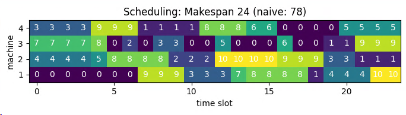

> The Job Shop Scheduling Problem (JSSP) is an NP-hard problem. [^1]

The JSSP is defined by a set of jobs that must be executed by
a set of machines in a specific order for each job. Each job has a defined execution time for each machine and
a defined processing order of machines. Also, each job must use each machine only once.
The machines can only execute a job at a time and once started, the machine cannot be interrupted until the completion of the assigned job.

The objective is to minimize the makespan, i.e. the maximum completion time among all jobs.

The JSSP is NP-hard for any fixed n ≥ 3 and also for any fixed m ≥ 3.

For instance, suppose we have 3 machines and 3 jobs. The processing order for each job is as follows
(the processing time of each job in each machine is between parenthesis):
- Job 1: 𝑚3 (2) → 𝑚1 (1) → 𝑚2 (2)
- Job 2: 𝑚2 (1) → 𝑚3 (2) → 𝑚1 (2)
- Job 3: 𝑚3 (1) → 𝑚2 (2) → 𝑚1 (1)

Bellow there are (at least) two feasible schedules [^1]:


The first schedule shows a naive solution: jobs are processed in a sequence and machines stay idle quite
often. The second solution is an optimal one, where jobs execute in parallel. This solution is not unique.

### Constraints
- All jobs 𝑗 must be executed following the sequence of machines given by $O^j$,
- Each machine can process only one job at a time,
- Once a machine starts a job, it must be completed without interruptions.
- every job can onlye run once per machine

### Solution Alternatives [^4]
#### Discrete time using time slots. 
This leads to binary variables:
$$
x_{j,m,t} = 
\begin{cases} 1 & \text{if job $j$ executes on machine $m$ at time $t$}\\ 
0 & \text{otherwise}
\end{cases}
$$

#### Continuous time with binary variables
Using binary variable indicating if job  $j$ is executed before job  $k$ (on the same machine)

## Model
Here I applied a classic MIP formulation from A.S. Manne [^2].

### Sets and Parameters
$$
\begin{aligned}
J = \{1,..,N_0\}: & \text{set of jobs}\\
M = \{1,..,M_0\}: & \text{set of machines}\\
R = \{1,..,M_0\}: & \text{number of steps per task}\\
o_r^j: & \text{machine which processes the $r$-th operation of job $j$}\\
O^j = (o_1^j,..,o_{M_0}^j): & \text{processing order of job j}\\
\mathit{proctime}_{m,j} \in N^+: & \text{processing time of job $j$ in machine $m$}\\
\end{aligned}
$$

To find a planning horizon T we just schedule each job after another:
$$
T = \sum_j proctime_j
$$
T is used as a big-M constant, so we would like it to be as tight as possible. 

### Variables
$$
\begin{aligned}
\mathit{makespan} \ : & \ \text{total process time}\\
\mathit{start}_{m,j} \ : & \ \text{start time of $j$ on machine $m$}\\
y_{mjk} = &
\begin{cases}
1, \ \text{ if job j precedes job k on machine m, $j \ne k$ }\\
0, \ \text{ else }\\
\end{cases}\\
\end{aligned}
$$

### Objective
$$
\begin{aligned}
\min\> & \mathit{makespan} \\
\end{aligned}
$$

### Constraints
#### Precedence Constraint
The first set of constraints are the precedence constraints, that ensure that a job on a
machine only starts after the processing of the previous machine concluded.
$$
\begin{aligned}
\mathit{start}_{o_r^j,j} \ge \mathit{start}_{o_{r-1}^j, j} + \mathit{proctime}_{o_{r-q}^j, j} \ \ & \forall r \in \{2,..,m\}, j \in J\\
\end{aligned}
$$

#### No-Overlapp Constraints
If the problem was a single machine scheduling problem, the no-overlap constraints would look like:

$$
\mathit{start}_{m,j} \ge \mathit{start}_{m,k} + \mathit{proctime}_{m,k} \ \text{ or } \ \mathit{start}_{m,k} \ge \mathit{start}_{m,j} + \mathit{proctime}_{m,j}\\
$$

Logical OR can be expressed by Big-M formulation:
$$
\mathit{start}_{m,j} \ge \mathit{start}_{m,k} + \mathit{proctime}_{m,k} - M y_{m,j,k} \\
\mathit{start}_{m,k} \ge \mathit{start}_{m,j} + \mathit{proctime}_{m,j} - M (1-y_{m,j,k}) \\
$$

I.e. job  $j$ executes before or after job $k$, but not in parallel.

This set of disjunctive constraints ensures that only one job is processing at a given time in a given machine. The
𝑀 constant must be large enough to ensure the correctness of these constraints. A valid (but weak)
estimate for this value can be the summation of all processing times. For larger models
tighter bounds need to be determined via heuristics.

$$
\begin{aligned}
\mathit{start}_{m,j} \ge \mathit{start}_{m,k} + \mathit{proctime}_{m,k} - M y_{m,j,k} \ \ & \forall j,k \in J, j \ne k, m\in M\\
\mathit{start}_{m,k} \ge \mathit{start}_{m,j} + \mathit{proctime}_{m,j} - M (1-y_{m,j,k}) \ \ & \forall j,k \in J, j \ne k, m\in M\\
\end{aligned}
$$

#### Makespan and Domain Constraints
The final set of constrains ensure
that the makespan value is computed correctly and the last constraints indicate variable domains.
$$
\mathit{makespan} \ge \mathit{start}_{o_{M_0}^j, j} + \mathit{proctime}_{o_{M_0}^j, j} \ \ \forall j \in J\\
\mathit{start}_{i,j} \ge 0\\
y_{m,j,k} \in \{0,1\}\\
\mathit{makespan} \ge 0\\
$$

#### Altogether
$$
\begin{aligned}
\mathit{start}_{o_r^j,j} \ge \mathit{start}_{o_{r-1}^j, j} + \mathit{proctime}_{o_{r-q}^j, j} \ \ & \forall r \in \{2,..,m\}, j \in J\\
\mathit{start}_{m,j} \ge \mathit{start}_{m,k} + \mathit{proctime}_{m,k} - M y_{m,j,k} \ \ & \forall j,k \in J, j \ne k, m\in M\\
\mathit{start}_{m,k} \ge \mathit{start}_{m,j} + \mathit{proctime}_{m,j} - M (1-y_{m,j,k}) \ \ & \forall j,k \in J, j \ne k, m\in M\\
\mathit{makespan} \ge \mathit{start}_{o_{M_0}^j, j} + \mathit{proctime}_{o_{M_0}^j, j} \ \ & \forall j \in J\\
\mathit{start}_{i,j} \ge 0\\
y_{m,j,k} \in \{0,1\}\\
\mathit{makespan} \ge 0\\
\end{aligned}
$$

# Implementation
Using [Pyomo](http://www.pyomo.org/) as modelling framework results in the following Python code for the constraints:
```python
def start_order_c(model, j, s):
    if s == 1:
        return Constraint.Skip
    o = model.machine_steps[j, s]
    o_1 = model.machine_steps[j, s - 1]
    return model.start[o, j] >= model.start[o_1, j] + model.proctime[o_1, j]

model.start_order_c = Constraint(model.J, model.R, rule=start_order_c)

def start_either_c(model, m, j, k):
    if j == k:
        return Constraint.Skip
    return model.start[m, j] >= model.start[m, k] + model.proctime[m, k] - M * model.y[m, j, k]

model.start_either_c = Constraint(model.M, model.J, model.J, rule=start_either_c)

def start_or_c(model, m, j, k):
    if j == k:
        return Constraint.Skip
    return model.start[m, k] >= model.start[m, j] + model.proctime[m, j] - M * (1 - model.y[m, j, k])

model.start_or_c = Constraint(model.M, model.J, model.J, rule=start_or_c)

def makespan_c(model, j):
    o = model.machine_steps[j, M_0]
    return model.makespan >= model.start[o, j] + model.proctime[o, j]

model.makespan_c = Constraint(model.J, rule=makespan_c)
```

# Results
The model solves very quickly with 4 machines and 10 jobs. 

Number of constraints : 760  
Number of variables : 441  
Duration: 00:00:06  

Optimal scheduling will reduce the total production time from 74 (naive approach) to 21, a 72% improvement.



Zero implies there are no job running on the machine at this time.

Increasing the number of jobs to 15 already resulted in an optimality gap of 7% after 30min calculation. Not very promising.

The no-overlap constraints for a continuous-time model do not scale well. Even small models take a long time to
solve. Others [^3] found similar results. One immediate angle of improvement would be to exploit symmetry in the 
non-overlap constraint and only compare jobs with $j < k$ instead of $i \ne k$.

Searching for alternative MIP formulations altogether is a task for another day, however.


[^1]: https://buildmedia.readthedocs.org/media/pdf/python-mip/latest/python-mip.pdf
[^2]: A.S. Manne. On the job-shop scheduling problem. Operations Research, 8(2):219–223, 1960.
[^3]: http://yetanothermathprogrammingconsultant.blogspot.com/2020/05/a-scheduling-problem.html
[^4]: http://yetanothermathprogrammingconsultant.blogspot.com/2019/06/machine-scheduling.html

