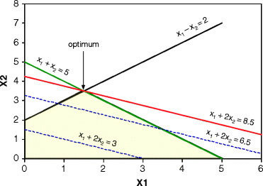

import styles from './index.module.css'

This is a primer on Linear Programming.

It is based on personal learning experience and focuses on application rather than theory.
For a rigorous approach please refer to a textbook.

[Wikipedia](https://en.wikipedia.org/wiki/Linear_programming):
> Linear programming (LP, also called linear optimization) is a method to achieve the best outcome 
> (such as maximum profit or lowest cost) in a mathematical model whose requirements are represented by linear relationships. 
> Linear programming is a special case of mathematical programming (also known as mathematical optimization).
  
> More formally, linear programming is a technique for the optimization of a linear objective function, 
> subject to linear equality and linear inequality constraints. Its feasible region is a convex polytope, 
> which is a set defined as the intersection of finitely many half spaces, each of which is defined by a linear inequality. 
> Its objective function is a real-valued affine (linear) function defined on this polyhedron. 
> A linear programming algorithm finds a point in the polytope where this function has the smallest (or largest) value if such a point exists.

## General Optimization Problem
##### Objective
$$
\text{Maximize} \ \sum_j c_jx_j \\
\text{subject to}\\
$$
##### Constraints
$$
\sum_j a_{ij}x_j = b_i, (i= 1, 2, ..., m)\\
x_j \ge 0, (j= 1, 2, ..., n)
$$

A Linear Programming system can either:

1. be unbound
1. be infeasible (no solution)
1. or have one optimal solution.

In this graphic solution the optimum is found with the maximum of the objective function $x_1 + 2x_2 = 8.5$.

Linear constraints define the 'feasible region' (yellow) for a solution and the objective function (red line)
is positioned such that it runs through the maximum or minimum corner of the 'feasible region' polygone. 
Optimized algorithms exist to find the solution in multidimensional space effectively (if it exists), e.g. Simplex
algorithm.

## General Facts
- The more constraints the more difficult a problem is to solve.
- An infeasible model has constraints which are over restrictive whereas an unbounded model either has vital constraints unrepresented or is insufficiently restrictive
- If, in a maximization problem, the optimal objective is lower than expected, our model might be over restrictive, some constraints are too severe.
- If the optimal objective is higher than expected, our model might be insufficiently restrictive, some constraints are too weak or have been left out.
- Any linear optimization problem that has an  optimal solution will have at least one vertex that is optimal (see picture above).
- Any Constraint must be 'tight', i.e. $\le$ instead of $\lt$.

## Simple Example
#### Objective Function
Maximize the following function:
$$
\max 3x_1 + 2x_2
$$

#### Constraints
$$
x_1 + x_2 \le 4 \\
2x_1 + x_2 \le 5 \\
-x_1 + 4x_2 \ge 2 \\
x_1, x_2 \ge 0\\
$$

#### Solution
This is a graphical solution of the model[^1]:

## Complex Example
A much more involved example [Car Rental](../car_rental/) demonstrates features of a real world Operations Research planning problem and
requires an adequate solver in order to find an optimal solution.

The next article [MIP for dummies](../mip_for_dummies) will cover Mixed Integer Programming which opens Mathematical Programming to a whole new world of
even more interesting problems.

[^1]: Inspired by: Model Building in Mathematical Programming by H.Paul Williams

