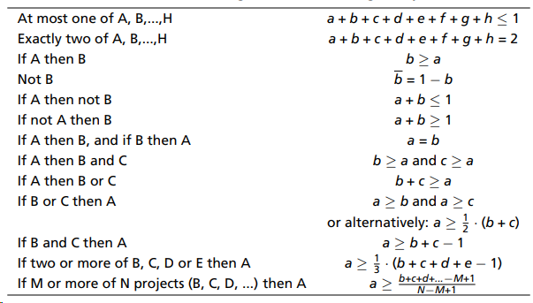

import styles from './index.module.css'

This is a collection of logic recipies for Mixed Integer Programming.
It builds on [Part3](../mip_for_dummies2).

It is based on personal learning experience and focuses on application rather than theory.
For a rigorous approach please refer to a textbook.

## Logic Recipies
All variables here can only take boolean values: $x_i, y \in{0, 1}$  
Let $X_i$ stand for the proposition $x_i=1$, anaolog for $Y$.

### if X then Y
$$
x \rightarrow y
$$

Set of constraints:
$$
y \ge x \\
$$
#### Example
You can launch satellite X only if you have chosen a compatible booster Y.

### Y then X1 AND X2 (and vice versa)
$$
y \leftrightarrow x_1 \land x_2
$$
Set of constraints:
$$
y \ge x_1 + x_2 -1\\
y \le x_1\\
y \le x_2\\
0 \le y \le 1 \\
$$

Generalized with range constraint:  
$$
y = x_1 \land ... \land x_n\\
0 \le \sum_i x_i -ny \le n-1\\
$$

#### Example
Y can be produced if and only if a machine X1 and worker X2 are available.”

### Y then X1 OR X2 (and vice versa)
$$
y \leftrightarrow x_1 \lor x_2
$$
y if and only if x1 or x2 or both.

$$
y \le x_1 + x_2 \\
y \ge x_1\\
y \ge x_2\\
0 \le y \le 1 \\
$$

generalized with range constraint:  
$$
y = x_1 \lor ... \lor x_n\\
0 \le ny - \sum_i x_i \le n-1\\
$$

#### Example
Project Y can be funded if and only if project X1 or project X2, or both projects are funded.

### XOR
$$
y \leftrightarrow x_1 \oplus x_2
$$
y if x1 or x2, but not both.

$$
y \le x_1 + x_2\\
y \ge x_1 - x_2\\
y \ge x_2 - x_1\\
y \le 2 - x_1 - x_2\\
0 \le y \le 1\\
$$

#### Example
Packaging line Y can receive product from either processing line X1 or processing line X2.

### Cheat Sheet
I helpful collection of recipies can be found [here](https://www.maths.ed.ac.uk/hall/Xpress/FICO_Docs/Xpress-booka4.pdf):

## Summary
This collection is a living document. If you have a recipe to be included, please let me know. I am more than
happy to extend the collection and cite the originator.

[^1]: https://orinanobworld.blogspot.com/2017/05/if-this-and-that-then-whatever.html

