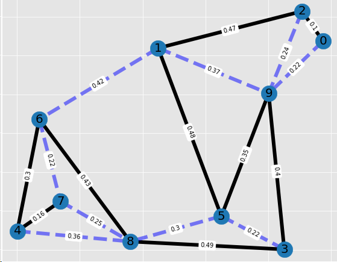

import styles from './index.module.css'

Normally you would be searching for the shortest path from A to B. At least this is what navigation systems
do. But here we want to look at the opposite problem: 

### What is the longest possible path to get from A to B?

[Wikipedia](https://en.wikipedia.org/wiki/Longest_path_problem)
> The longest path problem is the problem of finding a simple path of maximum length in a given graph. 
> In contrast to the shortest path problem, which can be solved in polynomial time in graphs without 
> negative-weight cycles, the longest path problem is NP-hard.

We are looking for a *simple path*, i.e. every node must only be visited (maximal) once. This sounds familiar to the
Traveling Salesman Problem. Indeed, the problem can be modelled in a similar form [^1]:

# Problem Formulation
$$
\max \sum_{(i,j)\in A} d_{i,j}x_{i,j}\\
$$
Network routing often gets modelled as a flow optimization problem. Hence, the typical flow balance constraints 
apply.

Node Flow Balance: flow in equals flow out of node:
$$
\sum_{j|(j,i) \in A} x_{j,i} + b_i = \sum_{j|(i,j) \in A} x_{i,j}, \ \forall i \\
$$

Outflow of each node must only go to one arc/edge:
$$
\sum_{j|(i,j) \in A} x_{i,j} \le 1 \ \forall i| i \ne \text{sink} \\
\sum_{j|(i,j) \in A} x_{i,j} = 0, \ i = \text{sink} \\
$$

Sub-tour elimination constraints are well-known from the Traveling Salesman Problem:
[Miller-Tucker-Zemlin formulation](https://en.wikipedia.org/wiki/Travelling_salesman_problem#Miller-Tucker-Zemlin_formulation).
$$
t_j \ge t_i + 1 + (n-1)(x_{i,j}-1) \ \forall i,j| i\ne \text{source}, j\ne \text{sink}\\
t_i \ge 0\\
$$

Integrity constraint:
$$
x_{i,j} \in {0,1}\\
$$

As input parameter we specify start and end node of our path:
$$
b_{i} =
\begin{cases}
1, \ \text{if i is start/source node}\\
-1, \ \text{if i is end/sink node}\\
0, \ \text{ else }\\
\end{cases}
$$

# Tooling
- [Pyomo](http://www.pyomo.org/) as LP modelling language
- Optimizer: [CBC](https://projects.coin-or.org/Cbc)
- [NetworkX](https://networkx.github.io/)
- Python

# Result
The sum of all edges in our network is 5.7660.

Walking from node 5 to node 0 will give us a workout of distance 2.97652.

Starting at 7 we can even cover a bigger distance: 3.17453.

For a network this size the optimizer has no difficulty to find the solution in a split-second. However, this is not
true for larger real world problems.

# Summary
Understanding how to extend a well known TSP Mixed Integer problem formulation to the Longest Path problem provides 
insights into Linear Programming. Applying [NetworkX](https://networkx.github.io/) to handle network
topology and visualization added another joyful aspect to this endeavor. Graphs made easy for everybody.

Special thanks to [Yet Another Math Programming Consultant](https://yetanothermathprogrammingconsultant.blogspot.com),
whose blog is an inspiration for everybody who fancies Mathematical Programming.

If you are interested in the Pyomo model or the Python code contact me via [mail](mailto:sysid@gmx.de).

[^1]: Inspired by: [Yet Another Math Programming Consultant](https://yetanothermathprogrammingconsultant.blogspot.com/2020/02/longest-path-problem.html)

