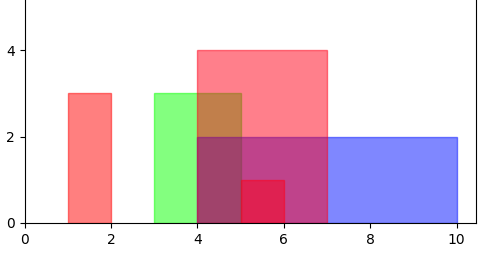
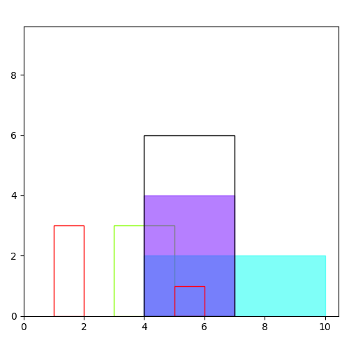
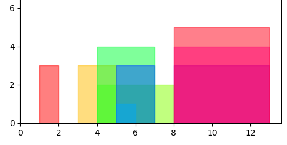

> Find the maximal overlap of rectangles so, that every selected rectangle covers the full width of the overlap area.

A selected rectangle can be larger than the overlap area, but not smaller.

### Problem Parameters:
- a set of rectangles aligned on the x-axis
- rectanges can have different heigt
- rectangles show arbitrary overlap


## Model
### Parameters
$$
i \in [1..N],\ \text{ index: N rectangles }\\
s_i \in R^+,\ \text{ start of rectangle $i$ }\\
e_i \in R^+,\ \text{ end of rectangle $i$ }\\
h_i \in R^+,\ \text{ height of rectangle $i$ }\\
M \in R^+,\ \text{ Big-M constant, upper limit for x }\\
$$

### Variables
$$
\delta_{i} =
\begin{cases}
1, \ \text{ rectangle $i$ is selected for the overlap }\\
0, \ \text{ else }\\
\end{cases}\\
x_s: \text{ start point of overlap area on x-axis }\\
x_e: \text{ end point of overlap area on x-axis }\\
x: \text{ width of the overlap area }\\
$$

### Constraints
$$
x = x_e - x_s\\
x_s \ge \delta_i s_i - (1-\delta_i)M, \forall i\\
x_e \le \delta_i e_i + (1-\delta_i)M , \forall i\\
x_s, x_e, x \in R^+\\
$$

### Objective
The sum of the area of selected rectangles within the overlap boundaries  should be maximized:
$$
\max \sum_i \delta_i h_i x\\
$$

This objective is quadratic and needs to be linearized:

#### Linearize Objective
$$
y_i = \delta_i x\\
max \sum_i h_i y_i\\
$$

This implies additional constraints:
$$
y_i \le M \delta_i\\
y_i \le x\\
y_i \ge x-M(1-\delta_i)\\
y_i \ge 0\\
$$

### Implementation
The model is very simple to implement with [Pyomo](http://www.pyomo.org/):
```python
model.I = RangeSet(len(config.get('blocks')))

################################################################################
# Params put at model
################################################################################

model.block = Param(model.I, domain=Any, initialize=dict(zip(model.I, config.get('blocks'))))
model.start = Param(model.I, domain=Reals, initialize=dict(zip(model.I, (x[0] for x in config.get('blocks')))))
model.end = Param(model.I, domain=Reals, initialize=dict(zip(model.I, (x[1] for x in config.get('blocks')))))
model.height = Param(model.I, domain=Reals, initialize=dict(zip(model.I, (x[2] for x in config.get('blocks')))))

################################################################################
# Var
################################################################################

model.delta = Var(model.I, domain=Binary, initialize=False)
model.xs = Var(domain=NonNegativeReals, initialize=0)
model.xe = Var(domain=NonNegativeReals, initialize=0)
model.x = Var(domain=NonNegativeReals, initialize=0)

model.y = Var(model.I, domain=NonNegativeReals, initialize=0)

################################################################################
# Constraints
################################################################################

model.x_order_c = Constraint(
    rule=lambda model: model.xs <= model.xe
)

model.x_c = Constraint(rule=lambda model: model.xe - model.xs == model.x)

M = 100
model.y_bound1_c = Constraint(
    model.I, rule=lambda model, i: model.y[i] <= M * model.delta[i]
)
model.y_bound2_c = Constraint(
    model.I, rule=lambda model, i: model.y[i] <= model.x
)
model.y_bound3_c = Constraint(
    model.I, rule=lambda model, i: model.y[i] >= model.x - M * (1 - model.delta[i])
)

model.xs_c = Constraint(
    model.I, rule=lambda model, i: model.xs >= model.delta[i] * model.start[i]
)
model.xe_c = Constraint(
    model.I, rule=lambda model, i: model.xe <= model.delta[i] * model.end[i] + (1 - model.delta[i]) * M
)

################################################################################
# Objective
################################################################################
def obj_profit(model):
    return sum(model.y[i] * model.height[i] for i in model.I)

model.objective = Objective(rule=obj_profit, sense=maximize)

```


## Solution
### Example 1


#### Configuration

```
example1 = {
    'blocks': [
        (1, 2, 3),
        (3, 5, 3),
        (4, 10, 2),
        (4, 7, 4),
        (5, 6, 1),
    ]
}
```
- Solution 18.0
- Number of constraints : 27
- Number of variables : 13
- Duration: 00:00:00

The black rectangle is the area of maximal overlap. The two filled rectangles are selected as constributors to the
overlap:



### Example 2


#### Configuration
```
example2 = {
    'blocks': [
        (1, 2, 3),
        (3, 5, 3),
        (4, 8, 2),
        (4, 7, 4),
        (5, 6, 1),
        (5, 7, 3),
        (8, 13, 3),
        (8, 13, 4),
        (8, 13, 5),
    ]
}
```

- Solution 60.0
- Number of constraints : 47
- Number of variables : 21
- Duration: 00:00:00


The solver CBC does not have a problem and solves the model in a split second.
