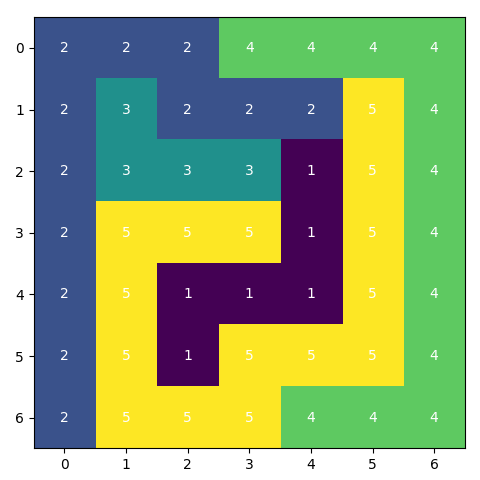
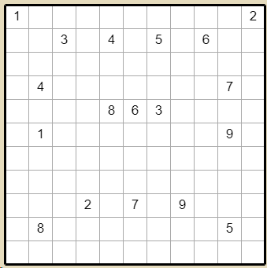
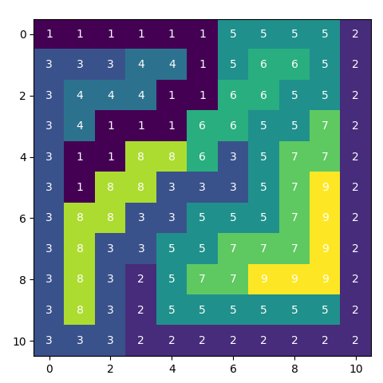

## Problem

1. Connect each two cells with the same numbers by a line. 
1. The sections of a line run horizontally or vertically.
1. Each cell must be visited exactly once by a line.


## Solution

> The trick is to identify endpoints of numberlinks. They do have only one neighbor with the same value. Cells wich are part of a
> path must have two neighbors with the same value.


The challenge is now to encode this insight into a Mixed Integer Programming model and fire up a solver.

There are different approaches to this problem, not all linear. We are going to implement one from Rob Pratt based
on a linearization of a mixed integer quadratically constrained model.
If you are interested in the background of the model (and you should!) then please refer to the inspiration
for this article: [Numberlink Models](https://yetanothermathprogrammingconsultant.blogspot.com/2017/09/numberlink-models.html) [^1].

## Model

$$
k: \text{number k}\\
p,q: \text{cells}\\
$$

### Variables
$$
x_{p,k} = 
\begin{cases}1 \text{ if cell $p$ has value $k$}\\
0 \text{ otherwise}\end{cases}
$$

### Parameters
$$
N_{pq} =
\begin{cases}
1, \ \text{ true if p,q are neighbors }\\
0, \ \text{ else }\\
\end{cases}\\
c_{pk} =
\begin{cases}
1, \ \text{ 1 if cell p is an end-point with value k }\\
0, \ \text{ else }\\
\end{cases}
$$

### Constraints
$$
\sum_{q|N(p,q)} x_{q,k}=1, \ \text{ if cell $p$ is an end-point with value $k$}\\ 
$$

$$
2x_{p,k}\le \sum_{q|N_{p,q}} x_{q,k} \le 2x_{p,k}+M_p(1-x_{p,k}), \ \text{ if cell $p$ is not an end-point} \\
$$

$$
M_p=|N(p,q)|=\sum_{q|N(p,q)} 1, \ \text{ number of neighbors of cell p, at most 4}\\
$$

$$
x_{p,k} = c_{p,k}, \ \text{ if cell p is an end-point}\\
x_{p,k} \in \{0,1\}\\
$$


## Implementation
We need the set of neighbors, which we use as bespoke index $N_{pg}$ in order to formulate the model constraints. 
```python
def create_neighbors(self) -> None:
    N = self.dimension
    M = self.dimension
    for i in range(1, N + 1):
        for j in range(1, M + 1):
            if i > 1:
                self.neighbors[i, j, i - 1, j] = 1
            if i < N:
                self.neighbors[i, j, i + 1, j] = 1
            if j > 1:
                self.neighbors[i, j, i, j - 1] = 1
            if j < M:
                self.neighbors[i, j, i, j + 1] = 1

model.N = Set(initialize=[n for n in self.neighbors if self.neighbors[n] == 1])
```

No we can write the main inequality constraint, i.e. cell $p$ is not an end-point:
```python
def x_lb_c(model, i, j, k):
    if (i, j, k) not in model.L:
        return 2 * model.x[i, j, k] <= sum(
            model.x[iii, jjj, k] for (ii, jj, iii, jjj) in model.N if ii == i and jj == j
        )
    else:
        return Constraint.Skip
model.x_lb_c = Constraint(model.I, model.J, model.K, rule=x_lb_c)

def x_ub_c(model, i, j, k):
    if (i, j, k) not in model.L:
        return sum(model.x[iii, jjj, k] for (ii, jj, iii, jjj) in model.N if ii == i and jj == j) <= \
               2 * model.x[i, j, k] + M * (1 - model.x[i, j, k])
    else:
        return Constraint.Skip
model.x_ub_c = Constraint(model.I, model.J, model.K, rule=x_ub_c)
```

Additionally, we create a helper index for the given path start- and end-points, which allows us to formulate the
corresponding constraint for numberlink edges concise:
```python
model.L = Set(initialize=[(i, j, k) for (i, j), k in self.links.items()])

def x_fixed_c(model, i, j, k):
    if (i, j, k) in model.L:
        return model.x[i, j, k] == 1
    return Constraint.Skip
model.x_fixed_c = Constraint(model.I, model.J, model.K, rule=x_fixed_c)
```


## Result

### 11 x 11
Running the model against this 11x11 puzzle [^2] was easy for CBC on 6 cores on my virtual machine. The solution
took less then 1s.





### 15 x 15
A solution for 15x15 is possible:  
- Number of constraints : 5625  
- Number of variables : 2700  
- Duration: 00:00:40  


### 20 x 20
Going for a bigger prize [^3] however did not result in a solution with CBC. After 12h I stopped the calculation.


Here the difference between Open Source and commercial solver becomes obvious. With a commercial solver (e.g. CPLEX, Gurobi) the problem can be solved within 43min:

- Number of constraints : 20400
- Number of variables : 10000
- Duration: 00:42:47


## Summary

For larger problems CBC MIP solver is not the best tool. For this kind of puzzle SAT solvers might be a better choice [^1].


[^1]: [Yet Another Mathprogramming Consultant](https://yetanothermathprogrammingconsultant.blogspot.com/2017/09/numberlink-models.html)
[^2]: [11x11](https://www.janko.at/Raetsel/Arukone-2/004.a.htm)
[^3]: [20x20](https://www.janko.at/Raetsel/Arukone-2/020.a.htm)
