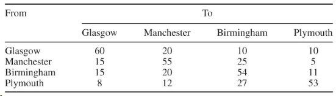
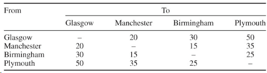
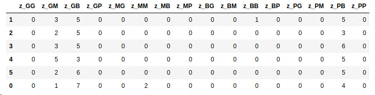

import styles from './index.module.css'

<div className={styles.Document}>

Modelling a car rental company with medium complexity or how to make 120k € per week.[^1]

If you need a primer on Linear Programming: [Linear Programming for Dummies 1](../lp_for_dummies)

### Tools employed:
- Linear programming
- Python
- [Pyomo](http://www.pyomo.org/) as LP modelling language
- Optimizer: [CBC](https://projects.coin-or.org/Cbc)

### Company model
Let's assume a car rental company with 4 locations and business hours from Monday to Saturday. 

The rental car demand estimate is:


Cars can be rented for 1, 2 or 3 days and can be returned to either the depot from which rented or another depot at the start of the next morning.
A 3-day rental on Friday means that the car has to be returned on Tuesday morning because Sunday is closed.

Maintenance cost per car is 15€ per week.

### KPIs
| Duration | proportion | marginal cost | rental cost return same depot | rental cost return another depot |
|:--------:|:----------:|:-------------:|:----------------------------:|:--------------------------------:|
|   1-day  |     55%    |      20€      |              50              |                70                |
|   2-day  |     20%    |      25€      |              70              |                100               |
|   3-day  |     25%    |      30€      |              120             |                150               |
In order to cover for weak weekend business there is a 20% discount for 1-day rentals on Saturday (return by Monday morning).

Estimates of percentages of cars hired from one depot and returned to a given depot independent of day:



It is possible to transfer undamaged cars from one depot to another depot, however
cars cannot be rented out during the day in which they are transferred.  

Transfer cost per car between depots:




### Repair centers:  
There is a 10% damage rate with returned cars. Per incident we charge 100€ flat to the customer. Damaged
cars need to be repaired in one of the two repair centers. Transfer to/from takes on day as does the repair itself.

1. Manchester, 12 cars per day  
1. Birmingham, 20 cars per day  

Example:  
If a damaged car is returned to Glasgow it has to be transferred to Manchester, be repaired and eventually
transferred back. After 3 days the car is ready for rental again.

### The following assumptions hold:  

1. Cars are returned in time in the morning, so they are ready for rental the same day  
1. Transferred cars also arrive in time for rental the same day  
1. Repaired cars can be rented out at repair centers without transfer  
1. Steady state solution is required, i.e. the same expected number of cars will be located at the same depot on the
same day of the week  

### Optimization Target:
1. How much money can be make?
1. How many cars should the company deploy to maximize profits?
1. Where should the cars be located at the start of each day?


## Mathematical Formulation
Integrality of cars can be neglected, since we are dealing with big enough numbers, so no MIP is necessary.

### Indices:
$i,j$: Depots  
$t$: Monday-Saturday, circular/steady state problem: $t_1=Mon \implies t_{-1}=Sat$  
$k \in {1,2,3}$: days rented  

### Parameters
$D_{it}$: demand at i on day t  
$P_{ij}$: proportion of cars rented at i to be returned to j  
$C_{ij}$: cost of transfer  
$Q_k$: proportion of cars hired for k days  
$R_i$: repair capacity of i  
$c_k$: rent price same return  
$d_k$: rent price different return  
$c^s$: rent same return Sat  
$d^s$: rent different return Sat  
$m_k$: marginal cost of k day hire $\forall i, t$  
$o$: opportunity cost of owning a car  

### Variables
$n$: total number owned cars  
$u_{it}$: number undamaged cars at i at beginning of t  
$u^e_{it}$: number undamaged cars left at i at end of t  
$v_{it}$: number damaged cars at i at beginning of t  
$v^e_{it}$: number damaged cars left at i at end of t  
$x_{it}$: number rented-out cars at i at beginning of t  
$y_{ijt}$: number of undamaged cars at i at beginning of to to be transferred to j  
$z_{ijt}$: number of damaged cars at i at beginning of to to be transferred to j  
$r_{it}$: number of damaged cars to be repaired at i  

### Constraints
Total number of undamaged cars into i on t:  
$$
\sum_{jk} 0.9P_{ji}Q_kx_{jt-k} + \sum_j y_{jit-1} + r_{it-1} + u^e_{it-1} = u_{it}
$$

Total number of damaged cars into i on t:  
$$
\sum_{jk} 0.1P_{ji}Q_kx_{jt-k} + \sum_j z_{jit-1} + v^e_{it-1} = v_{it}
$$

Total number of undamaged cars out of depot i on t:  
$$
x_{it} + \sum_j y_{ijt} + u^e_{it} = u_{it}
$$

Total number of damaged cars out of depot i on t:  
$$
r_{it-1} + \sum_j z_{ijt} + v^e_{it} = v_{it}
$$

Repair capacity at depot i on day t:
$$
r_{it} \le R_i\\
$$

Demand at depot i on day t:
$$
x_{it} \le D_{it}\\
$$

#### total number of cars in circulation
Total number of cars at beginning of Wednesday: outstanding cars + returned/grounded cars:  
1. number hired out on Monday for 3 days,
2. plus those on Tuesday for 2 or 3 days,
3. plus all damaged and undamaged cars in depots at the beginning of Wednesday.  
$$
\sum_i (0.25x_{i1} + (0.25+0.2)x_{i2} + u_{i3} + v_{i3}) = n, \forall i
$$

### Objective
10€ has been added to the profit on each rented car to reflect the surcharge of 100€ charged on the 10% of cars that are returned damaged.  
$$
\sum_{itk,t\ne6} P_{ii}Q_k(c_k -m_k + 10)x_{it}\\
+ \sum_{ijtk,t\ne6} P_{ij}Q_k(d_k -m_k + 10)x_{it}\\
+ \sum_{i6} P_{ii}Q_1(c^s -m_1 + 10)x_{it}\\
+ \sum_{ij6} P_{ij}Q_1(d^s -m_1 + 10)x_{it}\\
+ \sum_{i6k} P_{ii}Q_k(c_k -m_k + 10)x_{it}\\
+ \sum_{i6k} P_{ij}Q_k(d_k -m_k + 10)x_{it}\\
- \sum_{ijt} C_{ij}y_{ijt}\\
- \sum_{ijt} C_{ij}z_{ijt}\\
- 15n\\
$$

## Solution
The model has been implemented using [Pyomo](http://www.pyomo.org/) as modelling language. It combines the
effectiveness of specialized modelling languages like [GAMS](https://www.gams.com/) or [AMPL](https://en.wikipedia.org/wiki/AMPL)
with the capabilities of a general programming language which is especially
strong in data science. This results in a powerful solution tooling by combining strengths of various
engineering and mathematical disciplines.

### Constraints
Constraints are modelled as 'rules' in [Pyomo](http://www.pyomo.org/):
$$
\sum_{jk} 0.9P_{ji}Q_kx_{jt-k} + \sum_j y_{jit-1} + r_{it-1} + u^e_{it-1} = u_{it}
$$
```python
# Total number of undamaged cars into i on t
def u_in_c(model, d, i):
    return model.u[d, i] == \
           sum(
               0.9 * model.return_dist[j, i] * model.rental_dist[k] * model.x[(d - k + 6) % 6, j]
               for j in model.L for k in model.R
           ) + \
           sum(model.y[(d - 1 + 6) % 6, j, i] for j in model.L) + \
           model.r[(d - 1 + 6) % 6, i] + \
           model.ue[(d - 1 + 6) % 6, i]
```

### Objective Function
The objective function looks like:

```python
def obj_profit(model):
    rental_profit = sum(
        model.return_dist[i, j] *
        model.rental_dist[k] *
        (model.rental_cost[k, i, j] - model.marginal_cost[k] + 10) * model.x[d, i]
        for i in model.L for j in model.L for d in model.H for k in model.R
    )
    transfer_cost_undamged = sum(
        model.cost_transfer[i, j] * model.y[d, i, j]
        for i in model.L for j in model.L for d in model.H
    )
    transfer_cost_damged = sum(
        model.cost_transfer[i, j] * model.z[d, i, j]
        for i in model.L for j in model.L for d in model.H
    )
    opp_cost = 15 * model.n
    return rental_profit - transfer_cost_damged - transfer_cost_undamged - opp_cost
```

### Make the model stationary
To allow for a cyclical model (steady state) it is necessary to find a proper indexing schema for [Pyomo](http://www.pyomo.org/).

Monday corresponds to '1', Saturday to '0'. This schema allows to use the modulo operator in order to index
the business days in a closed cycle withouth having to worry about negative indices (see above formulas).
```python
d = 1  # Monday

# day before Monday (1) == Saturday (0)
assert (d - 1 + 6) % 6 == 0

# two days before Monday (1) == Friday (5)
assert (d - 2 + 6) % 6 == 5
```

### Results
#### Total number of cars:
The optimal number of cars is: 617. This translates to a profit of 121.160€ per week. Not bad!

#### Number of undamaged cars at beginning of day at respective depot


#### Number of damaged cars at beginning of day at respective depot


#### Transfer of damaged cars to repair centers
Transfers are happening from Glasgow to Manchester (z_GM), from Glasgow to Birmingham and from Plymouth to
Birmingham (z_PB).



The repair center are running at full capacity every day and are limiting profitability.

No undamaged cars are transferred between depots in the optimal solution. This is an efficient solution!

## Summary
Deploying a general purpose programming language together with a tightly integrated modelling language ([Pyomo](http://www.pyomo.org/))
allows for an elegant solution in order to solve this classical Operations Research problem. It certainly asks
for more. Stay tuned.

If you are interested in the Pyomo model or the Python code contact me via [mail](mailto:sysid@gmx.de).


[^1]: Inspired by: Model Building in Mathematical Programming by H.Paul Williams

</div>

