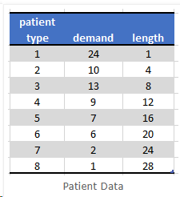
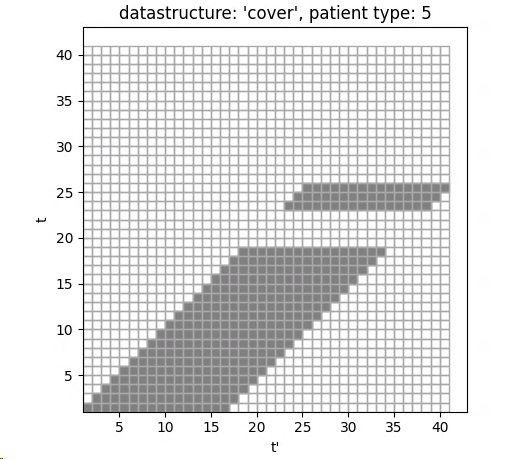
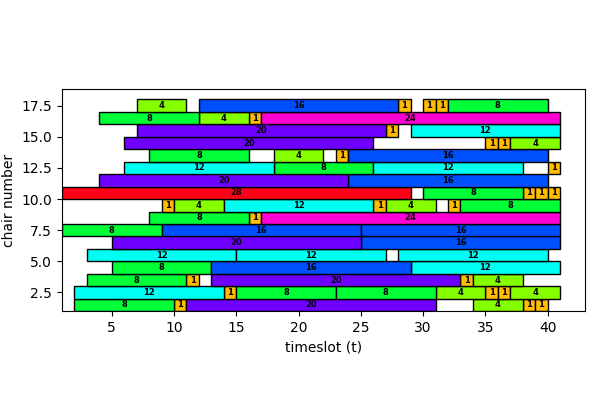

import styles from './index.module.css'

<div className={styles.Document}>

> How to optimize the scheduling of patients in order to use the necessary infrastructure, i.e. infusion chairs optimally.

### Problem Parameters [^1]:
- There are $T = 40$ time slots of 15 minutes
- We have 23 infusion chairs for patient treatment
- We have 8 different types of patients
- Each patient type has a demand (number of patients) and treatment length (expressed in 15 minute slots)
- No treatments can start during lunch break
- At most 2 treatments can start in each time slot. 



[Yet Another Mathprogramming Consultant](https://yetanothermathprogrammingconsultant.blogspot.com/2018/07/scheduling-of-patients.html)
provides a comprehensive treatment of the problem. Here I will focus on a Mixed Integer Programming 'grid approach'.

The problem can be modelled as a feasibility problem with a given set of infusion chairs. We are going to
extend this into an Optimization problem in order to find the optimal amount of chairs for the given patient requirements and therefore minimize the
required resources.

## Main Idea
As already demonstrated in [Mondriaan Puzzle](../mondriaan) and [Another Boring Lockdown Day](../tiling) the 
introduction of a binary data structure can help with the constraint formulation.
It encodes the information which time slots are covered by a potential patient
session starting in time slot $t$:

$$
cover_{p,t,t'} =
\begin{cases}
1, \ \text{ given start at $(p,t)$, $t'$ is part of treatment slot, $t' \in (t,..,t+length_p -1)$}\\
0, \ \text{ else }\\
\end{cases}
$$

It is important to note that $cover$ is a model parameter not a variable. The main idea is to be able to filter all potential patient sessions at a
timeslot $t'$.


If we look at the 15min timeslot $(p, t, 10)$ in the sketch above (right square), we find three 
overlapping sessions covering this timeslot. In order to impose a non-overlap
constraint, we can therefore formulate the non-overlap constraint as:

$$
\sum_{(p,t',t)|cover_{p,t,t'}} start_{c, p, t'} \le 1, \forall c, t
$$

Here I am illustrating how the datasctructure $cover$ looks like for patient type 5:


Notice the lunch break at $t=19$.

In order to create $cover$ it is necessary to pre-calculate all potential start slots for the respective patient type:


E.g. for patient type 1 a session can be started up until the last available slot $T=40$. Again notice the lunch break at $t=19$.
The longest lasting session, i.e. patient tpye 8, can start latest in time slot 13. 


## Tooling
- [Pyomo](http://www.pyomo.org/) as LP modelling language
- Optimizer: [CBC](https://projects.coin-or.org/Cbc)
- [matplotlib](https://matplotlib.org/) for visualization
- Python

# Model

## Sets
$$
t \in (1,..,T): \ \text{ 15min time interval }\\
p \in (1,..,P): \ \text{ patient type }\\
c \in (1,..,C): \ \text{ infusion chair }\\
$$

## Parameters/Data
$$
T = 40: \ \text{ number of time slots }\\
P = 8: \ \text{ number of patient types }\\
C = 23: \ \text{ number of infusion chairs}\\
$$

$$
cover_{p,t,t'} =
\begin{cases}
1, \ \text{ given start at $(p,t)$, $t'$ is part of treatment slot, $t' \in (t,..,t+length_p -1)$}\\
0, \ \text{ else }\\
\end{cases}
$$

## Variables
$$
start_{c,p,t} =
\begin{cases}
1, \ \text{ if session for patient of type p starts in time slot t in chair c }\\
0, \ \text{ else }\\
\end{cases}\\
$$

Variable to minimize number of chairs:
$$
usechair_{c} =
\begin{cases}
1, \ \text{ if chair c is used }\\
0, \ \text{ else }\\
\end{cases}
$$

## Objective
$$
\min \sum_c usechair_c\\
$$

## Constraints
Sessions need to be compact and non-overlapping and can only be used by one patient at a time:
$$
\sum_p \sum_{t'=t-length_p+1}^t start_{c,p,t'} \le usechair_c, \ \forall c,t \\
$$

This can be simplified with the help of $cover$ to:

$$
\sum_{(p,t',t)|cover_{p,t,t'}} start_{c, p, t'} \le usechair_c, \ \forall c, t
$$

Chair ordering constraint to break symmetry and order the output:
$$
usechair_c \le usechair_{c-1} \ \forall c > 1\\
$$

Meet demand:
$$
\sum_{c,t} start_{c,p,t} = demand_p \ \forall p\\
$$

We cannot start a session if there are not enough time slots left to finish the session. I.e. we have:
$$
t \ge T-length_p + 2 \Rightarrow start_{c,p,t} = 0\\
$$

At most 2 treatment sessions starting per time slot:
$$
\sum_{c,p} start_{c,p,t} \le 2, \forall t \\
$$

Lunch break:
$$
start_{c,p,t} = 0, t \in (19,20,21,22)
$$


## Pyomo Implementation
Since a lot of the required logic for selecting time slots and ensuring that patient sessions are compact and non-overlapping
is already encoded into the parameter-set $cover$, the resulting Pyomo implementation is basically three lines of code (LOC):
```python
# This will find all variables start(c,p,tt) that potentially cover the slot (c,t)
def chair_c(model, c, t):
    return sum(model.start[c, pp, tt] for (pp, tt, ttt) in model.Cover if ttt == t) <= model.usechair[c]

model.chair_c = Constraint(model.C, model.T, rule=chair_c)
```
This is remarkable given the fact, that these 3LOC implement the main idea of the model.


# Result
Patients to be served: 72  
Slot demand: 584, available slots: 920

The given parameter set shows room for optimization with regards to the number of necessary infusion chairs.

Number of constraints : 4141  
Number of variables : 7383  
The optimal solution requires 17 infusion chairs.
 
The resulting schedule is:



The CBC solver finds a feasible and optimal solution in less than 2s for this model. Interesting to note that the
original formulation according to [^2] was not solvable on my machine. Only the trick of introducing $cover$ made the
model easy to solve for CBC.

# Summary
The Scheduling Problem demonstrates that the presented 'grid approach' is a universal technique to model 
problems which require a compact and non-overlapping constraint.

In [Mondriaan Puzzle](../mondriaan) and [Another Boring Lockdown Day](../tiling) this approach helped in
solving tiling puzzles. Here we tackled a very different problem domain with the same fundamental approach.

[Task Scheduling](../scheduling) will look at other aspects of the same problem domain.

Thanks to [Yet Another Math Programming Consultant](https://yetanothermathprogrammingconsultant.blogspot.com) for his
inspiration.

If you are interested in the Pyomo model or the Python code contact me via [mail](mailto:sysid@gmx.de).


[^1]: Inspired by [Yet Another Mathprogramming Consultant](https://yetanothermathprogrammingconsultant.blogspot.com/2018/07/scheduling-of-patients.html)
[^2]: Anali Huggins, David Claudio, Eduardo Pérez,  Improving Resource Utilization in a Cancer Clinic: An Optimization Model, Proceedings of the 2014 Industrial and Systems Engineering Research Conference, Y. Guan and H. Liao, eds., https://www.researchgate.net/publication/281843060_Improving_Resource_Utilization_in_a_Cancer_Clinic_An_Optimization_Model

</div>
