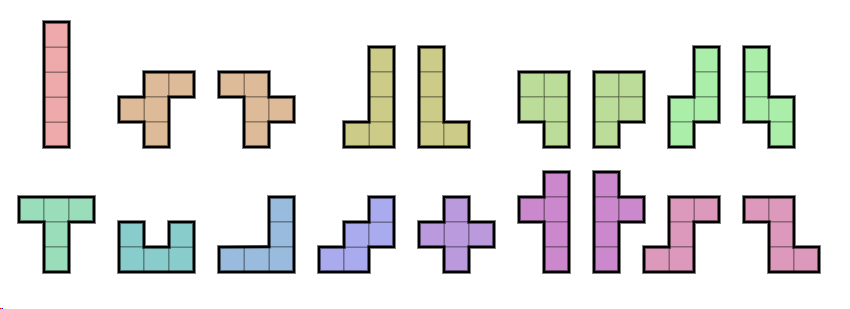
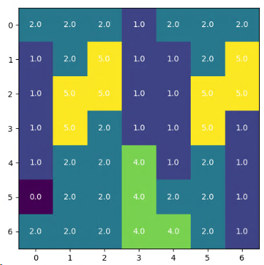

## Problem
> Fill a rectangle with polyominos.

[What is a Polyomino?](https://en.wikipedia.org/wiki/Polyomino)  
A plane geometric figure formed by joining one or more equal squares edge to edge. 
It is a polyform whose cells are squares. It may be regarded as a finite subset of the regular square tiling.

# Model
Since this puzzle is just another form of tiling challenge we can reuse concepts and ideas from 
[Mondriaan Puzzle](../mondriaan), [Another Boring Lockdown Day](../tiling) and [Patient Scheduling](../patient_scheduling).

### Sets
There we already saw how the introduction of special binary data structures 
allows us to formulate non-overlapping constraints elegantly.

The helper-set $ok_{k,i,j}$ encodes the viable positions for polyominos to be placed within the grid:
$$
ok_{k,i,j} = 
\begin{cases} 
1 & \text{if polyomino $k$ can be placed at location $(i,j)$ within grid}\\
0 & \text{otherwise} 
\end{cases}\\
$$

The set $cover_{k,i,j,i',j'}$ consists of elements that exist if cell $(i',j')$ is covered when we place polyomino k in cell $(i,j)$. 
$$
cover_{k,i,j,i',j'} = 
\begin{cases} 
1 & \text{if polyomino $k$ placed at $(i,j)$ covers cell $(i',j')$}\\
0 & \text{otherwise} 
\end{cases}\\
$$

Hence a non-overlap constrain is equivalent to require that each cell $(i',j')$ is covered exactly once:

$$
\sum_{k,i,j|cover_{k,i,j,i',j'}} x_{k,i,j} = 1, \forall i',j'  
$$

This is a very strong constraint which makes many puzzle configurations unsolvable (infeasible).

### Variables
As long as we treat the puzzle as a feasibility problem, we only need one binary variable:
$$
x_{k,i,j} = 
\begin{cases} 
1 & \text{if we place polyomino $k$  at location $(i,j)$}\\
0 & \text{otherwise} \end{cases}
$$

Since we would also like to see
close solutions to the problem we need to relax the constraints in order to facilitate meaningful output 
from the solver.

### Relaxation
To make the model always feasible we introduce a slack variable:

$$
y_{i,j} = 
\begin{cases}
1 & \text{ $(i,j)$ is covered exactly once }\\
0 & \text{otherwise} 
\end{cases}\\
$$

Now we maximize this variable in order to cover as many grid cells as possible. This leads to the final
Mathematical Programming formulation:

$$
\max\>\sum_{i,j} y_{i,j}\\
y_{i',j'} = \sum_{k,i,j|cover_{k,i,j,i',j'}} x_{k,i,j}\\
x_{k,i,j}\in \{0,1\}\\
y_{i,j} \in \{0,1\}
$$

# Implementation

Implementing the model in Pyomo is straightforward and compact:

```python
### Sets
model.K = Set(initialize=self.blocks.keys())
model.I = RangeSet(self.dimension)
model.J = RangeSet(self.dimension)
model.ok = Set(initialize=self.ok.keys())
model.cover = Set(initialize=self.cover.keys())

### Var
model.x = Var(model.K, model.I, model.J, domain=Boolean, initialize=0,
              doc='if we place polyomino k at location (i,j)')

model.y = Var(model.I, model.J, domain=Boolean, initialize=0,
              doc='(i,j) is covered exactly once (allow infeasable solutions)')

### Constraints
def overlap_c(model, iii, jjj):
    return sum(
        model.x[k, i, j] for (k, i, j, ii, jj) in model.cover if ii == iii and jj == jjj
    ) == model.y[iii, jjj]

model.overlap_c = Constraint(model.I, model.J, rule=overlap_c)

### Objective
def obj(model):
    return sum(model.y[i, j] for i in model.I for j in model.J)
```

## Result
To have a fix point with regard to the correctness of our solution we start with the setup from [^1] which employs 5
polyominos to fill a $(11x11)$ grid.


This is a very simple problem which CBC solves within a split-second:


- Number of indices in $ok_{k,i,j}$: 458
- Number of indices in $cover_{k,i,j}$: 1832
- Solution: 120, i.e. not all cells (121) can be filled
- Number of constraints : 121
- Number of variables : 726

It is to be noted, that the problem is trivial for even-sided grids.

### A optimal solution: 41x41


- Number of indices in $ok_{k,i,j}$: 13800
- Number of indices in $cover_{k,i,j}$: 67442
- Solution: 120, i.e. not all cells (1681) can be filled
- Number of constraints : 1681
- Number of variables : 16810
- Duration: 00:05:02

The 61x61 model of [^1] could not be solved with CBC on my machine.


# Tetris
To extend the puzzle to the famous 'Tetris' game we need to allow rotations of the polyominos. This extends the
number of variables and constraints significantly. Symmetry considerations need to be applied in order to minimize the number
of additional variables.

## Model
Since the main business logic is encoded in the binary data structure $cover_{k,r,i,j,i',j'}$ the 
MP formulation only requires one additional index which encodes the rotational state of a polyomino:

$$
ok_{k,r,i,j} = 
\begin{cases} 
1 & \text{if polyomino $k$ with rotation $r$ can be placed at location $(i,j)$ within grid}\\
0 & \text{otherwise} 
\end{cases}\\
cover_{k,r,i,j,i',j'} = 
\begin{cases} 
1 & \text{if polyomino $k$ with rotation $r$ placed at $(i,j)$ covers cell $(i',j')$}\\
0 & \text{otherwise} 
\end{cases}\\
$$

The maximization problem is now:

$$
\max\>\sum_{i,j} y_{i,j}\\
y_{i',j'} = \sum_{k,r,i,j|cover_{k,r,i,j,i',j'}} x_{k,i,j}\\
x_{k,i,j}\in \{0,1\}\\
y_{i,j} \in \{0,1\}
$$

The challenge lies with creating $cover_{k,r,i,j,i',j'}$, of course.

However, since data structures can be debugged much easier than MP constraint equations, taking the route of creating bespoke indices
pays off.

## Result
The complexity of this problem is significantly higher due to the number of variables. Solving a simple grid of
only $(7x7)$ takes with CBC already more than 2min:

### 7x7
- Number of indices in $ok_{k,i,j}$: 452
- Number of indices in $cover_{k,i,j}$: 1808
- Solution: 48, i.e. not all cells (49) can be covered
- Number of constraints : 49
- Number of variables : 1029
- Duration: 00:02:22




# Summary
In [Mondriaan Puzzle](../mondriaan) and [Another Boring Lockdown Day](../tiling) we already learned how to
formulate tiling puzzles. Practice is required in order to effectively solve the challenge of creating the
binary data structure $cover_{k,r,i,j,i',j'}$. 

The lessons learned in applying e.g. `numpy` for grid manipulation
translate into other domains like Data Science or even general software development.

If you are interested in the Pyomo model or the Python code contact me via [mail](mailto:sysid@gmx.de).


[^1]: Inspired by [Yet Another Mathprogramming Consultant](https://yetanothermathprogrammingconsultant.blogspot.com/2017/12/filling-rectangles-with-polyominos.html)
