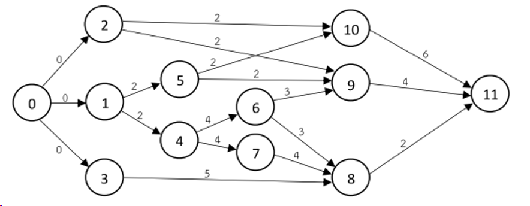
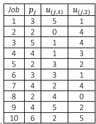
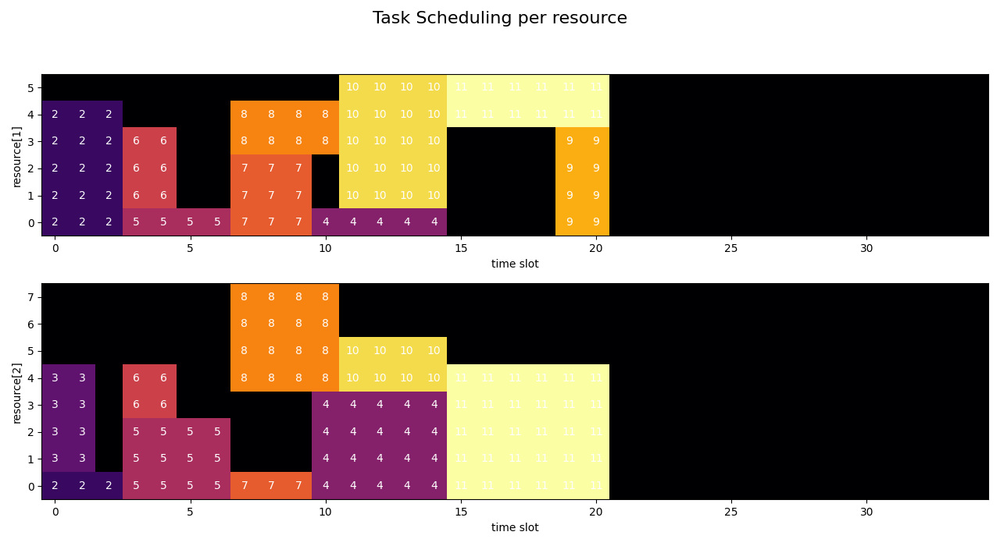

Scheduling tasks in a large project translates to facing a graph optimization challenge:




> The Resource-Constrained Project Scheduling Problem is a combinatorial optimization problem that consists of finding
a feasible scheduling for a set of $n$ jobs subject to resource and precedence constraints.

## Problem Domain: Network Optimization.

Taks are represented by nodes. Dependencies of tasks on predecessors form a directed graph. Every task has got a 
duration which is represented by the weight of the directed edges of the graph. Tasks consume limited resources.
In order to provide an entry and exit point to the graph we introduce two *dummy* tasks, 
$x_0, x_{n+1}$ with duration 0 and no resource consumption (a.k.a. sentinels).

# Model

$$
\begin{aligned}
J: &\text{ jobs set }\\
R: &\text{ renewable resources set }\\
S: &\text{ set of precedences (edges) between jobs $(𝑖, 𝑗) \in J \times J$ }\\
T: &\text{ planning horizon: set of possible processing times for jobs }\\
p_j &\text{ processing time of job 𝑗 }\\
u_{r,j} &\text{ amount of resource 𝑟 required for processing job 𝑗}\\
c_r &\text{ capacity of renewable resource $r$ }\\
\end{aligned}
$$


Example with two resources $r1, r2$ and resource usage $u_{j,r}$:



### Variable
$$
x_{jt} =
\begin{cases}
1, \ \text{ if job 𝑗 is completed in period t }\\
0, \ \text{ else }\\
\end{cases}
$$

### Objective
Minimize the total duration of task completion subject to dependency and resource constraints:
$$
\min \sum_t (t-1) x_{n+1, t}\\
s.t.\\
$$

### Constraints
Every job incl. end sentinel must be finished latest by end of last time interval:
$$
\sum_t x_{j,t} = 1, \ \forall j \in J \cup \{n+1\}\\
$$

#### Resource Consumption Constraint:
A job is being processed in period $t$ if the job is completed in period $q$ where:
$$
t \le q \le t + p_j
$$ 

$$
\sum_j \sum_{q=t}^{\min{\{T+1, t+p_j\}}} u_{j,r} x_{j,q} \le c_r, \ \forall t, r \\
$$

For another technique to formulate this kind of constraint see [Patient Scheduling problem](https://sysid.github.io/patient_scheduling/).
There we simplify this constraint type with the help of a binary helper data structure.

#### Sequence constraint:
Job $m$ must precede job $n$. If $t_m, t_n$ denote the completion time, then:

$$
t_m + p_n \le t_n \\
t_j = \sum_t t x_{j,t}\\
$$

$$
\sum_t t x_{j,t} + p_s \le \sum_t t x_{s,t} , \ \forall (j,s) \in S \\
$$

#### Binary Constraint:
$$
x_{j,t} \in \{0,1\}\\
$$


# Implementation
This time the solution of the problem provides two interesting challenges:

## 1. Solving the MIP problem
The implementation with [Pyomo](http://www.pyomo.org/) is close to the mathematical problem formulation and therefore straight forward. 
However, testing and debugging the resource consumption constraint proved to be more involved than expected.

```python
# resource consumption contraint:
def resource_c(model, t, r):
    if t == len(model.T):
        return Constraint.Skip
    return sum(
        model.u[j, r] * model.x[j, q]
        for j in list(model.J)[1:-1]
        for q in range(
            t, min(len(model.T) + 1, t + value(model.p[j]) - 0)
        )
    ) <= model.c[r]

model.resource_c = Constraint(model.T, model.R, rule=resource_c)
```

Testing the decisions of a MIP solver involves indirect reasoning. There is no debugger which can be attached to the
solver in order to set breakpoints (unless you are the solver's developer, of course). 

As a software developer it is probably good advice to follow a path as in
[Patient Scheduling](https://sysid.github.io/patient_scheduling/), where complexity is taken out of the mathematical model and put
into helper data structures which can be tested and debugged with tools of the trade.

## 2. Visualizing the result
Since we have a multi-dimensional result, visualization requires some thought. After all we want to see the temporal sequence of
tasks together with a representation of respective resource consumption. Tasks will run in parallel when resource consumption allows for it.

Luckily with [mathplotlib](https://matplotlib.org/) we have a Python library which provides all the necessary routines and tools in order to visualize 
even the most complex data-sets.

I chose to visualize 'swim lanes' per resource, where the height of the swim lane represents the resource limit, and the
 length represents the maximum length if all jobs would have been run sequentially (naive solution).
 
 
# Result

Our example problem is a relatively small MIP problem and CBC has no problems solving it within a second:

Number of constraints : 97  
Number of variables : 420  



The optimal solution is more than one third 'better' than the naive solution by parallelizing tasks where
possible. Hereby the sequence of tasks is respected as well as the limitation of resources. Get more done in the same amount of time.

If you are interested in other MIP problems regarding task scheduling, please check out [Task Scheduling](https://sysid.github.io/scheduling/),
[The Book of Mormon](https://sysid.github.io/reading/) and [The Book of Mormon II](https://sysid.github.io/reading2/).


