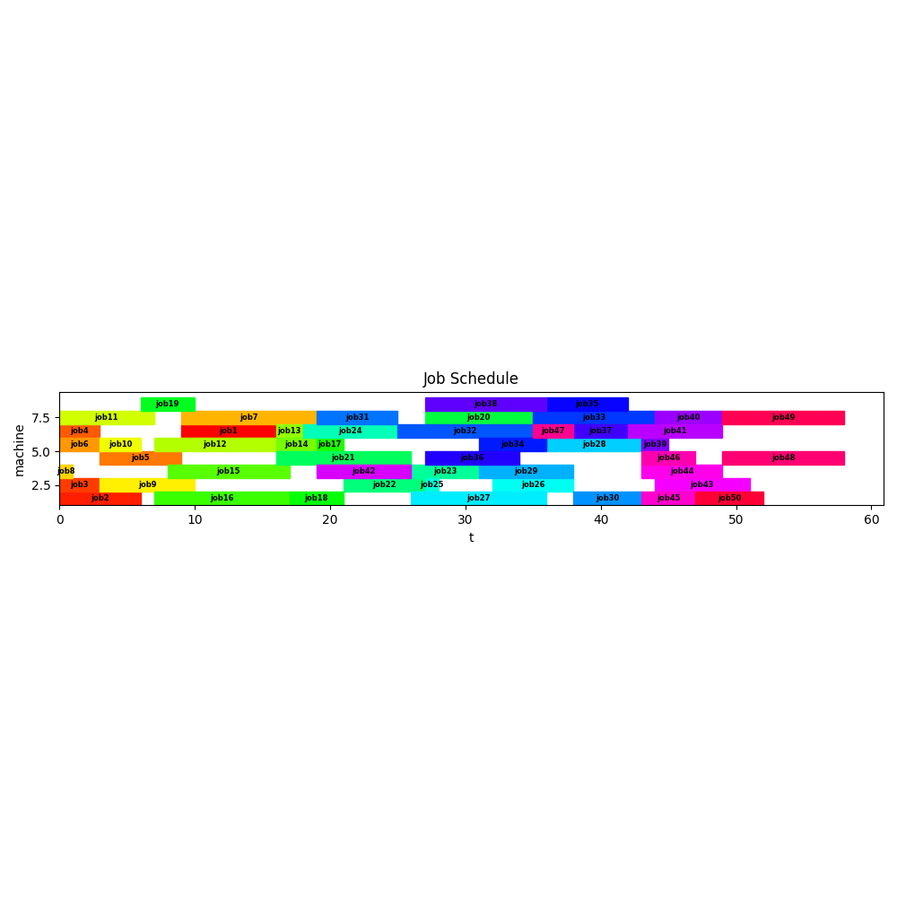

I already analysed several scheduling problems: 
- [Task Scheduling](../scheduling)
- [Task Scheduling with limited Resources](../scheduling_with_constraints)
- [Job Shop Scheduling Problem](../jssp)
- [Patient Scheduling](../patient_scheduling)

The class of scheduling problems is interesting and every example provides new insight. Here I am going to look at
two problems which can be solved with a very similar and quite common approach: The
**continuous time model** approach.

## Problem 1: Machine Scheduling

> Schedule jobs onto available machines so, that the total processing time (a.k.a. makespan) is minimized.

- There are N machines and M jobs
- Not all machines can do all jobs
- We have a precedence constraints between the jobs
- The jobs have different processing times

For model formulation it is helpful to define two indices:

### Incides
To model the machine and job precedence constraints we need some data:

#### Which job runs on which machine
$$
\mathit{ok}_{j,m} =
\begin{cases}
1 & \text{if job $j$ is allowed on machine $m$}\\
0 & \text{otherwise}\end{cases}
$$

#### Which job precedes what other job
$$
\mathit{prec}_{j_1,j_2} =
\begin{cases}
1 & \text{if job $j_1$ preceds $j_2$}\\
0 & \text{otherwise}\end{cases}
$$

### Variables
We need three continouus and two binary variables for our problem.
One binary variable is dealing with assigning of jobs to machines: 
$$
\mathit{assign}_{j,m} = 
\begin{cases} 
1 & \text{if job $j$ is placed on machine $m$}\\ 
0 & \text{otherwise}\end{cases}
$$

A second one describes the ordering of jobs on the same machine (no-overlap constraints). 
For this we need a binary variable indicating if job $j_1$ is before or after job $j_2$:

$$
\mathit{after}_{j_1,j_2} = 
\begin{cases} 
1 & \text{if job $j_1$ is executed after job $j_2$ when placed on the same machine}\\ 
0 & \text{if job $j_1$ is executed before job $j_2$ when placed on the same machine}
\end{cases}
$$

Note that the variable $after_{j_1,j_2}$ will be used only for $j_1 < j_2$ . This is to avoid double checking the same pair.

Addtionally there are the following continuous variables:
$$
\begin{aligned} 
& \mathit{start}_{j} \ge 0 && \text{start time of job $j$}\\
& \mathit{finish}_{j} \ge 0  && \text{finish time of job $j$}\\
& \mathit{makespan} \ge 0  && \text{last finish time}
\end{aligned}
$$

### Constraints
To sequence the jobs according to the requirements we need the following constraints:

#### Jobs must run on same machine
Jobs on different machines can run in parallel, i.e. are not consrained by 'non-overlap' constraint:
$$
start_{j2} \ge end_{j1} - T(1-assign_{j_1, m}) - T(1-assign_{j_2, m})\\
$$
If one of the $assign$ terms is not zero, the constraint is not effective, i.e. the job an run in parallel.

#### Either job1 runs before job2 or vice versa
Here the classic 'either/or' big-M construct is used:
$$
start_{j1} \ge end_{j2} - T (1-after_{j_1, j_2}), \forall j_1 \le j_2\\
start_{j2} \ge end_{j1} - T after_{j_1, j_2}, \forall j_1 \le j_2\\
$$

### Model [^1]
The complete model is:
$$
\begin{aligned} \min\> & \color{DarkRed}{\mathit{makespan}} \\
& \color{DarkRed}{\mathit{makespan}} \ge \color{DarkRed}{\mathit{finish}}_j && \forall j \\
& \color{DarkRed}{\mathit{finish}}_j = \color{DarkRed}{\mathit{start}}_j + \color{DarkBlue}{\mathit{proctime}}_j && \forall j\\
& \sum_m \color{DarkRed}{\mathit{assign}}_{j,m} = 1 && \forall j\\
& \color{DarkRed}{\mathit{start}}_{j_1} \ge \color{DarkRed}{\mathit{finish}}_{j_2} - \color{DarkBlue}T (1-\color{DarkRed}{\mathit{after}}_{j_1,j_2}) - \color{DarkBlue}T (1-\color{DarkRed}{\mathit{assign}}_{j_1,m})- \color{DarkBlue}T (1-\color{DarkRed}{\mathit{assign}}_{j_2,m}) && \forall m, j_1 \lt j_2 \\
& \color{DarkRed}{\mathit{start}}_{j_2} \ge \color{DarkRed}{\mathit{finish}}_{j_1} - \color{DarkBlue}T \color{DarkRed}{\mathit{after}}_{j_1,j_2} - \color{DarkBlue}T (1-\color{DarkRed}{\mathit{assign}}_{j_1,m})- \color{DarkBlue}T (1-\color{DarkRed}{\mathit{assign}}_{j_2,m}) && \forall m, j_1 \lt j_2 \\ 
& \color{DarkRed}{\mathit{start}}_{j_2} \ge \color{DarkRed}{\mathit{finish}}_{j_1} && \forall \color{DarkBlue}{\mathit{prec}}_{j_1,j_2} \\
& \color{DarkRed}{\mathit{assign}}_{j,m} = 0 && \forall \text{ not } \color{DarkBlue}{\mathit{ok}}_{j,m} 
\end{aligned}
$$

The color coding is taken from [^1]: blue represents data and red represents model variables.

### Results
A simple test model with 4 jobs on 3 machines looks like:

Using a mall model helps to validate and test the model.

But even using more complex data the model solves surprisingly easy on the Open Source combination of Pyomo as modelling language and CBC als solver.
Here the results for a model with 50 jobs scheduled on 8 machines:

- Solution: 58.0
- Number of constraints : 20102
- Number of variables : 3001
- Duration: 00:00:03

## Problem 2: Category Scheduling

> Schedule jobs so, that the total processing time (a.k.a. makespan) is minimized. Jobs of the same category can run
in parallel.

- There are 5 categories and 50 jobs.
- Jobs of different category can not run in parallel.
- We have a precedence constraints between the jobs.
- The jobs have different processing times.

This problem is very similar to the first one, except the sequencing requirements are slightliy different: Instead
of having jobs cabale to be done only on dedicated machines, jobs are part of a category. Unsurprisingly the model
looks very similar.

The resulting no-overlap constraint is simplified by devising an appropriate sub-set of allowed $(i,j)$ job combinations
($\mathit{NoOverlap}$):

Valid combinations are:
1. only if $i < j$
1. only if there is no other precedence constraint already in effect
1. only if jobs are of a different category. 

$\mathit{NoOverlap}$ defines which elements $( i , j )$ need no-overlap constraints.

### Model [^2]

$$
\begin{aligned} 
\min\> & \color{darkred}{\mathit{makespan}}\\ 
& \color{darkred}{\mathit{makespan}} \ge  \color{darkred}{\mathit{end}}_j && \forall j\\ 
&   \color{darkred}{\mathit{end}}_j =  \color{darkred}{\mathit{start}}_j  + \color{darkblue}{\mathit{length}}_j&& \forall j \\ 
&  \color{darkred}{\mathit{end}}_j \le \color{darkblue}{\mathit{due}}_j  && \forall j | \color{darkblue}{\mathit{due}}_j \text{ exists}\\ 
& \color{darkred}{\mathit{end}}_i  \le  \color{darkred}{\mathit{start}}_j && \forall i,j|\color{darkblue}{\mathit{Precedence}}_{i,j} \text{ exists}\\ 
& \color{darkred}{\mathit{end}}_i  \le  \color{darkred}{\mathit{start}}_j +\color{darkblue} M \color{darkred}\delta_{i,j} && \forall i,j|\color{darkblue}{\mathit{NoOverlap}}_{i,j} \\ 
&\color{darkred}{\mathit{end}}_j  \le  \color{darkred}{\mathit{start}}_i +\color{darkblue} M (1-\color{darkred}\delta_{i,j}) && \forall i,j|\color{darkblue}{\mathit{NoOverlap}}_{i,j} \\ 
& \color{darkred}{\mathit{start}}_j, \color{darkred}{\mathit{end}}_j \ge 0 \\ & \color{darkred}\delta_{i,j} \in \{0,1\}
\end{aligned}
$$

### Results
This model proves to be surprisingly difficult to solve for the OSS combination Pyomo and CBC. 
CBC did not produce a solution within 8 hours. However, with a commercial solver the model can be solved:

- Solution 102.753
- Number of constraints : 2065
- Number of variables : 2601
- Duration: 00:00:50

# Summary
Open Source cannot solve all problems. There is a reason why commercial solvers are extremely expensive.

[^1]: http://yetanothermathprogrammingconsultant.blogspot.com/2019/06/machine-scheduling.html
[^2]: http://yetanothermathprogrammingconsultant.blogspot.com/2020/01/a-scheduling-problem.html