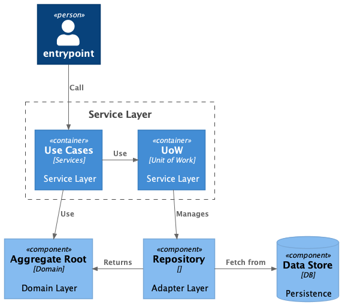
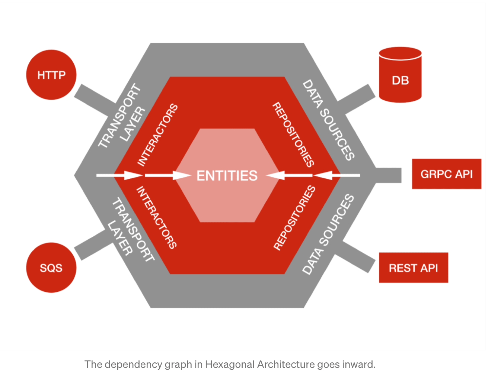
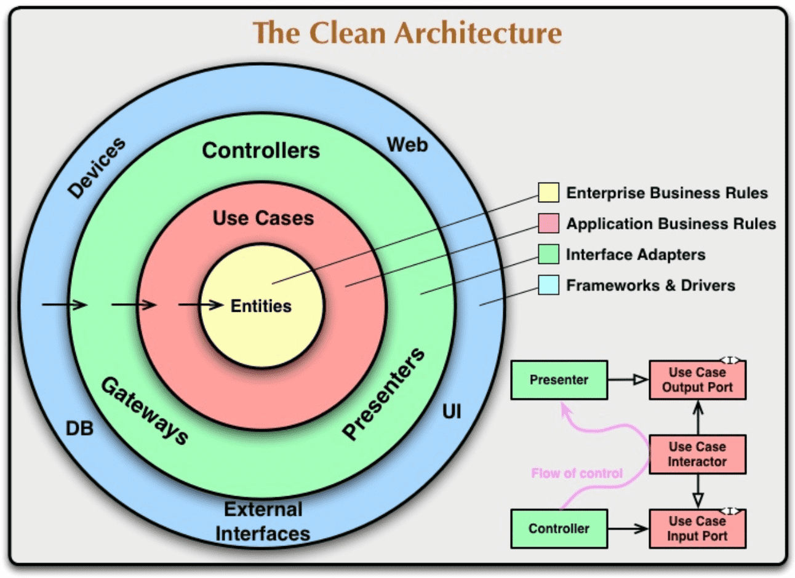
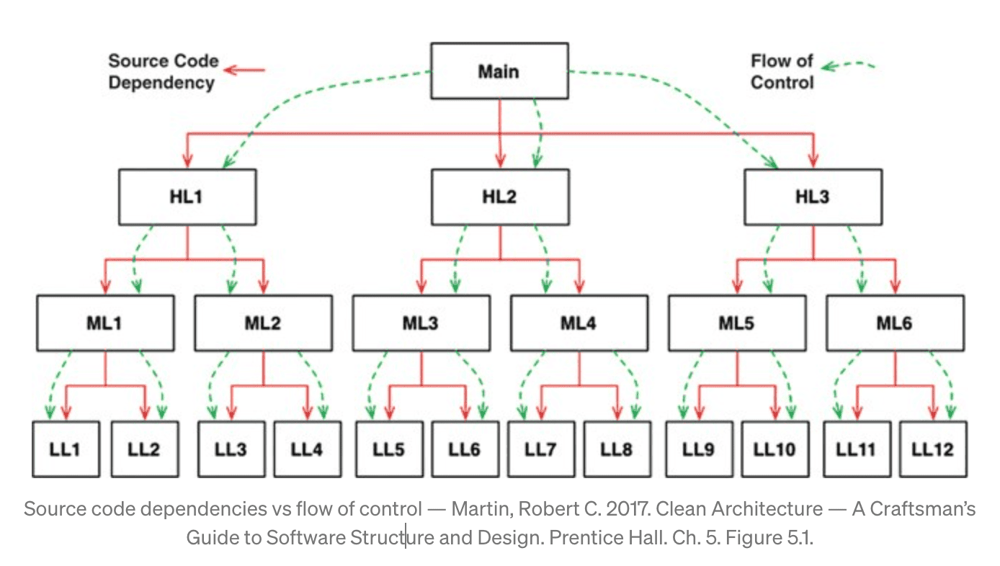
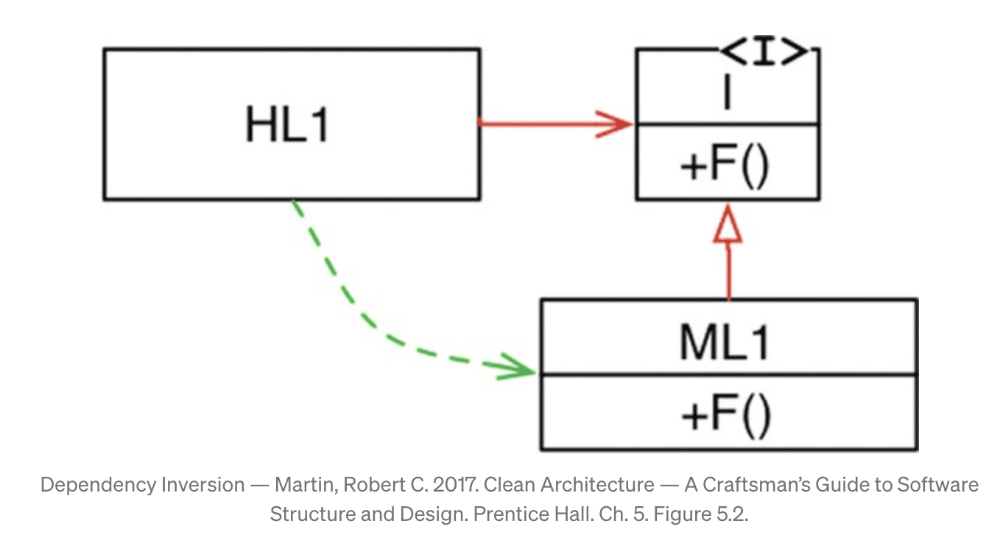
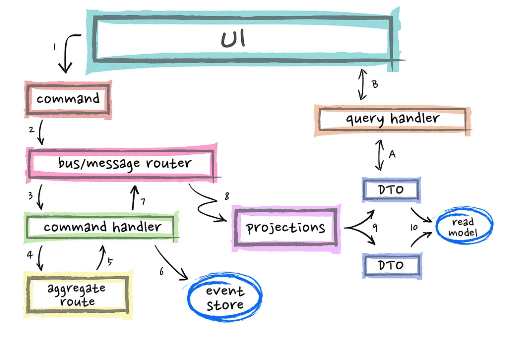
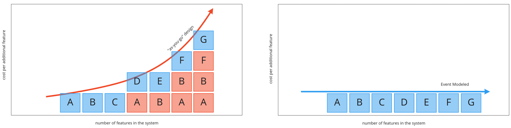
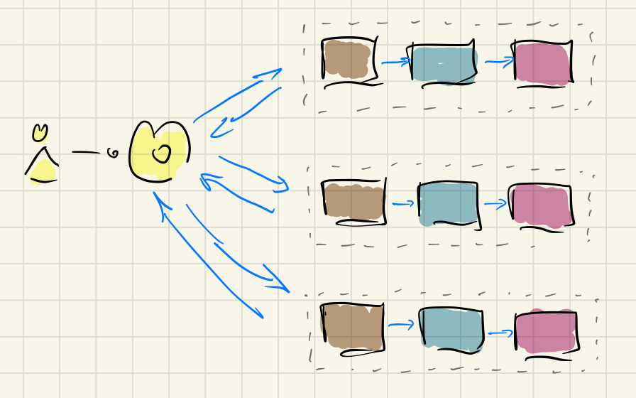
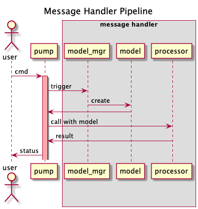

> A refresher in software architecture philosophies with Perseverance, Patience and Python.

This is a high-speed overflight over current approaches with an occasional deep dive.

## CRUD, MVC
- simple concepts and therefore effective communication in dev teams
- works as expected. Limits known, e.g. modelling complex business domains

## DDD and Clean Architecture

- structure of software logic reflects business processes
- **ubiquitous language** as common communication ground for developer and business
- concepts like **Aggregate** and **UnitOfWork** provide clear consistency and concurrency model. Facilitates communication.
- Clean Architecture and DI is conducive to structured and decoupled code (SRP)

Every system has these two kind of arrows:
the dotted-green one showing the flow of control (or the flow of data in your system) and the red one showing the source code dependency.

Usually, both of them are pointing in the same direction.
However, with the dependency inversion principle, we can invert the red arrow (the dependency arrow) every time we want.
Everywhere we need it.

Thanks to the power of polymorphism.

## DDD, CQRS and Event Sourcing

- differentiating between mutating functions and read-only is best practice 101.
- CQRS (without Event Sourcing) is old news. We are running dedicated OLTP DBs for decades.

So let's rather focus on Event Sourcing:

[Why is it cool?](https://dev.to/barryosull/event-sourcing-what-it-is-and-why-its-awesome)
- high modelling flexibility
- scalability due to append-only write together with optimistic locking
- USP: temporal queries, branching in history for what if scenarios, state time travel

Modelling flexibility is my favorite:

It is a bold promise which I -- due to limited experience -- cannot comment on.

#### Challenges:
- introduces significant complexity
- eventual consistency (at least) on read side
- event schema migrations are hard
- debugging not straight forward due to Events' implicit instead of explicit call paths

Overall I found discussion in the Community to be inconsistent. Similar terms different meanings. E.g. "Event" can mean DomainEvent,
Notification, Command, ...

# Next Level: Food Truck Architecture?
> Dissolution of the single Domain Model into many parallel worlds.

Take Event Sourcing, can the idea of Aggregates, generalize event pipelines and then arrive
at an interesting conclusion:

**?! The Domain Model Fallacy !?**

Or is it more "Back to the Future": [multiple canonical models](https://martinfowler.com/bliki/MultipleCanonicalModels.html).

[The Food Truck Architecture](https://ralfw.de/food-truck-architecture-its-all-about-events/)
cooks interesting thought food.

#### Value Proposition: Maximize Modelling Flexibility

> The evolutionary demands on software are so huge that I think the first and foremost requirement to fulfill is changeability, malleability. Flexibility first!

[It is all about events](https://ralfw.de/food-truck-architecture-its-all-about-events/) was intriguing enough for me
to refine the provided C# example into a [Python model](https://github.com/sysid/food_truck) for experimentation and insight.

One pipeline rules all:

For every message a bespoke model (projection) is being created and passed to the processor.
And every message (command, query, notification) is handled the same.

### Conclusion
- using a unified pipeline for Commands, Queries and Notifications is a logic development for Event Sourcing, if
not event handling in general. It has potential so simplify architecture.
- having bespoke read-only models within every pipeline is a an optional optimization to build business logic
- the described development and architecture model reduces cognitive load (after conquering
the non trivial learning curve, of course) due to its simple recipe and purported share nothing architecture.

The main issues I found while playing with the code revolve around consistency and concurrency:
- not having an aggregate with well defined consistency boundaries makes reasoning about consistency and
concurrency difficult if not impossible.
- without a aggregate root, I could not find a natural criteria to define event streams. So optimistic
concurrency handling becomes fragile, if possible at all.

After all, these issues challenge the very foundation of the model:
Forgoing global business objects (e.g. aggregate) and assuming a shared nothing world between pipelines.

The presented ideas are still very early stages and it is not recommended to jump ship with serious workloads. However, it provides ideas
worth to be explored deeper! And it is definitely a pleasure to read Ralph's clear and well writen articles.

So, at least now I can say, that I used my Covid quarantine in a rewarding way :-).

# Resources
<small>
https://netflixtechblog.com/ready-for-changes-with-hexagonal-architecture-b315ec967749
https://medium.com/gdplabs/clean-architecture-a8b5d93d0944
https://blog.cleancoder.com/uncle-bob/2012/08/13/the-clean-architecture.html
https://danielwhittaker.me/2020/02/20/cqrs-step-step-guide-flow-typical-application/
https://ralfw.de/food-truck-architecture-its-all-about-events/
https://www.eventmodeling.org/posts/what-is-event-modeling/
</small>
