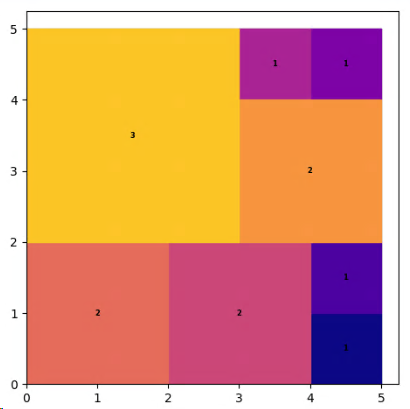
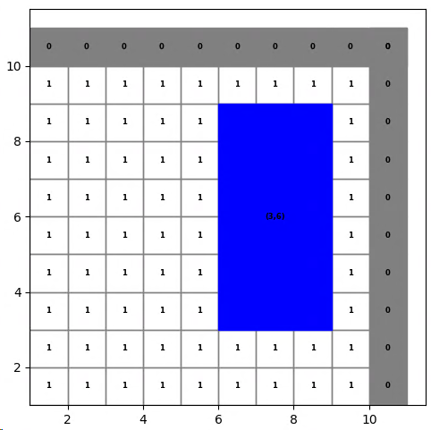
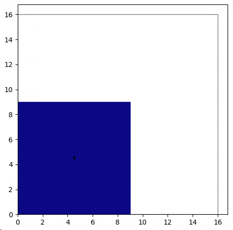
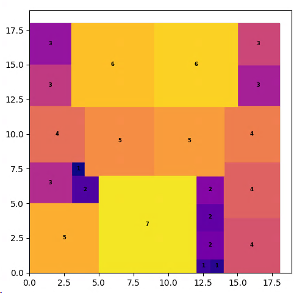
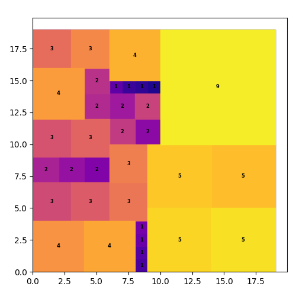

import styles from './index.module.css'

<div className={styles.Document}>



> Given an inventory of square tiles, what is the maximum square space we can fill with them?

The picture above consists of the following set of tiles:

| length | 1 | 2 | 3 |
|--------|---|---|---|
| count  | 4 | 3 | 2 |

8 out of the 9 given tiles can be used to form the resulting (5x5) square. One (3x3) tile cannot be used. 
With the given set this is the larges square area we can fill.

[Yet Another Mathprogramming Consultant](https://yetanothermathprogrammingconsultant.blogspot.com/2020/03/tiling.html)
provides two different formulations of the problem. Here I will focus on the better performing 'grid approach'.
Also this approach has similarity with [Mondriaan Puzzle](../mondriaan) so we can reuse and extend some
of already learned techniques here.

## Grid Approach

We split the potential area which we want to fill into a grid of element cells. This allows us to impose constraints
per cell and formulate packing and coverage constraints elegantly.

### Main Idea
We introduce a binary data structure to encode the information which grid cells are covered by a tile $i$ at
position $(p,q)$:
$$
cover_{i,p,q,p',q'} =
\begin{cases}
1, \ \text{ if $(p',q')$ is covered when tile i is placed at $(p,q)$}\\
0, \ \text{ else }\\
\end{cases}
$$

The main idea is now the introduction of a boolean 'grid' variable which marks the area to fill:
$$
y_{p',q'} =
\begin{cases}
1, \ \text{ if $(p',q')$ is within our current area to fill }\\
0, \ \text{ else }\\
\end{cases}
$$
This is a variable, because the area is shrinking during the solution process.



Here we have a tile at $(6,3)$ which conforms to the covering constraint (CC), i.e. lies within the viable squared area
and is therefor a solution candidate.

To keep track of $y$ and make sure there are not holes we need another (ordered) binary variable:
$$
\delta_p \le \delta_{p-1}, \ \forall p\\
\sum_p \delta_p = W \\
$$

To form a 'square constrain' for our grid variable we formulated:
$$
y_{p,q} = \delta_p \delta_q \\
$$

This non-linearity can be linearized by standard means (see below).

### Upper Bound for solution
The maximal possible area which we can fill if we use all tiles from inventory is just the sum of all individual tile areas.
So an upper bound for the side length of the enclosing square is:
$$
P = floor(\sqrt{\sum_i size_i^2})
$$

However, the resulting square can be significantly smaller than this upper bound.
Example for this given set:

| length | 1 | 2 | 3 | 4 | 5 | 6 | 7 | 8 | 9 |
|--------|---|---|---|---|---|---|---|---|---|
| count  | 1 | 1 | 1 | 1 | 1 | 1 | 1 | 1 | 1 |

We could expect to fill a square of size:
$$
P = floor(\sqrt{285}) = 16
$$

Here we can only use the (9x9) tile:



All other tile combinations of that set do not result in a square area.


## Tooling
- [Pyomo](http://www.pyomo.org/) as LP modelling language
- Optimizer: [CBC](https://projects.coin-or.org/Cbc)
- [matplotlib](https://matplotlib.org/) for visualization
- Python

# Model

## Sets
$$
i: \ \text{tiles}\\
p,q: \ \text{ gridpoints } p,q \in (1..P)\\
p',q': \ \text{ gridpoints } p',q' \in (1..P+1)\\
$$

## Parameters/Data
Maximal possible length of area to be filled if all tiles from inventory are used:
$$
P = floor(\sqrt{\sum_i size_i^2})
$$

$$
size_i: \ \text{ size of tile i}\\
cover_{i,p,q,p',q'}: \ \text{ 1 if (p',q') is covered by tile i at (p,q) }\\
$$

Parameter to indicate coverage of field $(p',q')$:
$$
cover_{i,p,q,p',q'} =
\begin{cases}
1, \ \text{ if $(p',q')$ is covered when tile i is placed at $(p,q)$}\\
0, \ \text{ else }\\
\end{cases}
$$

## Variables
$$
x_{i,p,q} =
\begin{cases}
1, \ \text{ if tile i is placed at location (p,q) }\\
0, \ \text{ else }\\
\end{cases}
$$

Then for each location $(p,q)$ we check that the number tiles covering this location is equal to one within the area to fill and zero outside. This results in two additional variables:

Variable to indicate whether the covered field is within current area to fill:
$$
y_{p',q'} =
\begin{cases}
1, \ \text{ if $(p',q')$ is within our current area to fill }\\
0, \ \text{ else }\\
\end{cases}
$$

This matrix $y$ starts as large as possible, i.e. the number of rows and columns is determined by the max area provided by the inventory or squares. During the optimization this area can shrink. Due to this dynamic $y$ must be a variable.

Starting value for matrix y is (P+1 x P+1).

The way to keep track of $y$ is to introduce a binary varialbe:
$$
\delta \in \{0, 1\}\\
\delta_p \le \delta_{p-1}\\
\sum_p \delta_p = W\\
$$

$$
W: \ \text{ width of space that can be filled }\\
$$

## Objective
$$
max W
$$

## Constraints
#### Each tile can be placed max once:
$$
\sum_{q,p} x_{i,p,q} \le 1 \ \forall i\\
$$

#### Cover Constraint (CC):
Each cell inside the fill area is covered exactly once, outside of the area there must be no coverage.
$$
\sum_{i,p,q} cover_{i,p,q,p',q'} x_{i,p,q} = y_{p',q'} \ \forall p', q' \\
$$

#### Pattern constraint for matrix $y$:
The way to keep track of $y$ is to introduce a binary varialbe:
$$
\delta \in \{0, 1\}\\
\delta_p \le \delta_{p-1}\\
\sum_p \delta_p = W\\
$$

#### Constraint for matrix $y$:  
The first W rows and columns are ones. The other entries are zeros. One extra row and column of zeros for safeguarding against covering outside the area. These constraints are a linearization of a binary multiplication.
 
$$
y_{p,q} = \delta_p \delta_q\\
$$
This non-linear constraint needs to be linearized:
$$
y_{p',q'} \le \delta_{p'}\\
y_{p',q'} \le \delta_{q'}\\
y_{p',q'} \ge \delta_{p'} + \delta_{q'} -q\\
$$

## Pyomo Implementation
The Pyomo implementation is close to the mathematical model. Here an example for the constraint definition:
```python
    # tile can be placed max once:
    model.tile_c = Constraint(
        model.K,
        rule=lambda model, k: sum(model.x[k, i, j] for i in model.I for j in model.J) <= 1
    )

    # cover constraint:
    def all_covered_c(model, ii, jj):
        covers = [key for key, _ in cover.items() if (key[3] == ii and key[4] == jj)]
        return sum(model.cover[k, i, j, ii, jj] * model.x[k, i, j]
                   for (k, i, j, ii, jj) in covers) == model.y[ii, jj]
    model.all_covered_c = Constraint(model.I, model.J, rule=all_covered_c)
```
Index mapping: `cover[k, i, j, ii, jj]` corresponds to $cover_{i,p,q,p',q'}$.


# Result
Given set:

| length | 1 | 2 | 3 | 4 | 5 | 6 | 7 |
|--------|---|---|---|---|---|---|---|
| count  | 7 | 6 | 5 | 4 | 3 | 2 | 1 |

Resulting square area:


It is noted in [^1] that the binary variable $y_{p,q}$ can be relaxed to $y_{p,q} \in [0,1]$.
However, for me this constraint relaxation of $y$ increased the solution time from 20s to 2:17min.
An unexpected observation which I have no explanation for (ideas welcome).

Here another result after 26min running on 6 cores:

| length | 1  | 2  | 3 | 4 | 5 | 9 |
|--------|----|----|---|---|---|---|
| count  | 10 | 10 | 8 | 5 | 4 | 1 |

Total area is 383, which results in a theoretical maximum square width of 19.



Here 2 (1x1) tiles and one (2x2) tile could not be used for the solution, however this is very close to perfection.
The side length of the filled area actually hits the theoretical maximum of 19.

# Summary
This challenge helped to deepen the understanding of tiling problems. Extending and practicing skills and techniques from
[Mondriaan Puzzle](../mondriaan) allowed for a much quicker progress in sovling this puzzle. And again many thanks to
[Yet Another Math Programming Consultant](https://yetanothermathprogrammingconsultant.blogspot.com) for publishing
his work.

An interesting extension of the tiling principle to a scheduling problem: [Patient Scheduling](../patient_scheduling).

If you are interested in the Pyomo model or the Python code contact me via [mail](mailto:sysid@gmx.de).


[^1]: Inspired by [Yet Another Mathprogramming Consultant](https://yetanothermathprogrammingconsultant.blogspot.com/2020/03/tiling.html)

</div>
