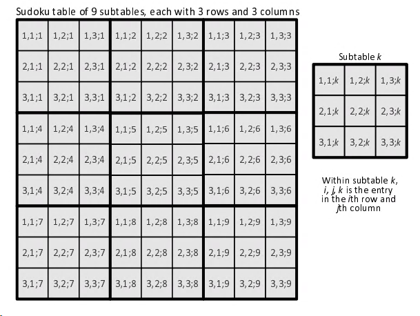
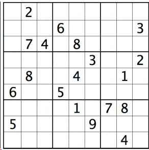

import styles from './index.module.css'

<div className={styles.Document}>


[Wikipedia](https://en.wikipedia.org/wiki/Sudoku)

> a logic-based, combinatorial number-placement puzzle.

Fill a 9×9 grid with digits so that each column, each row, and each of the nine 3×3 subgrids 
that compose the grid contain all of the digits from 1 to 9. 

The puzzle setter provides a partially completed grid, which for a well-posed puzzle has a single solution.

## Challenges

1. Understand the problem (easy)
1. Design the index sets (medium)
1. Translate the model into Pyomo (easy)

## Tooling
- [Pyomo](http://www.pyomo.org/) as LP modelling language
- Optimizer: [CBC](https://projects.coin-or.org/Cbc)
- Python

# Model

## Indexing Schema


## Variables
$$
y^m_{i,j;k} =
\begin{cases}
1, \ \text{ when cell $(i,j;k)$ contains number $m$ }\\
0, \ \text{ else }\\
\end{cases}
$$

Example: If 7 appears in $(2,1;1)$, then $y^7_{2,1;1} = 1$

## Row Constraints
$$
\sum_{k=1}^3\sum_{j=1}^3 y_{i,j;k}^m, (i=1,2,3, m=1,..,9)\\
$$

$$
\sum_{k=4}^6\sum_{j=1}^3 y_{i,j;k}^m, (i=1,2,3, m=1,..,9)\\
$$

$$
\sum_{k=7}^9\sum_{j=1}^3 y_{i,j;k}^m, (i=1,2,3, m=1,..,9)\\
$$

## Column Constraints
$$
\sum_{k \in \{1,4,7\}} \sum_{i=1}^3 y_{i,j;k}^m = 1, (j=1,2,3, m=1,..,9)\\
$$

$$
\sum_{k \in \{2,5,8\}} \sum_{i=1}^3 y_{i,j;k}^m = 1, (j=1,2,3, m=1,..,9)\\
$$

$$
\sum_{k \in \{3,6,9\}} \sum_{i=1}^3 y_{i,j;k}^m = 1, (j=1,2,3, m=1,..,9)\\
$$

## Sub-Table Constraint
Subtable contains every number $m$ once:
$$
\sum_{i=1}^3 \sum_{j=1}^3 y_{i,j;k}^m = 1, (k,m=1,..,9)\\
$$

## Completeness Constraint
Each cell has a number in it:
$$
\sum_{m=1}^9 y_{i,j;k}^m = 1, (k=1,..,9 \ i,j=1,2,3)\\
$$

## Objective
This is not a maximization problem. Only solution feasibility is relevant, so we assume a constant objective.

## Pyomo Implementation
The implementation in Pyomo is straightfoward:
```python
# Row Constraint
model.row_c_1_3 = Constraint(model.I, model.M, rule=lambda model, i, m: sum(
    sum(model.y[i, j, k, m] for j in model.J) for k in model.K if k <= 3) == 1)

model.row_c_4_6 = Constraint(model.I, model.M, rule=lambda model, i, m: sum(
    sum(model.y[i, j, k, m] for j in model.J) for k in model.K if 4 <= k <= 6) == 1)

model.row_c_7_9 = Constraint(model.I, model.M, rule=lambda model, i, m: sum(
    sum(model.y[i, j, k, m] for j in model.J) for k in model.K if 7 <= k) == 1)

# Row Constraint
model.col_147_c = Constraint(model.J, model.M, rule=lambda model, j, m: sum(
    sum(model.y[i, j, k, m] for i in model.I) for k in model.K if k in (1, 4, 7)) == 1)

model.col_258_c = Constraint(model.J, model.M, rule=lambda model, j, m: sum(
    sum(model.y[i, j, k, m] for i in model.I) for k in model.K if k in (2, 5, 8)) == 1)

model.col_369_c = Constraint(model.J, model.M, rule=lambda model, j, m: sum(
    sum(model.y[i, j, k, m] for i in model.I) for k in model.K if k in (3, 6, 9)) == 1)

# Sub-Table constraint
model.subtable_c = Constraint(model.K, model.M, rule=lambda model, k, m: sum(
    sum(model.y[i, j, k, m] for i in model.I) for j in model.J) == 1)

# One number per cell constraint
model.number_c = Constraint(
    model.I, model.J, model.K, rule=lambda model, i, j, k: sum(model.y[i, j, k, m] for m in model.M) == 1
)
```

# Result
Here our the input, a fairly difficult Sudoku for humans:



It takes less than a second to solve for MIP solver CBC:
```
---------------------------------
[ 1  2  6 ][ 4  3  7 ][ 9  5  8 ]
[ 8  9  5 ][ 6  2  1 ][ 4  7  3 ]
[ 3  7  4 ][ 9  8  5 ][ 1  2  6 ]
---------------------------------
[ 4  5  7 ][ 1  9  3 ][ 8  6  2 ]
[ 9  8  3 ][ 2  4  6 ][ 5  1  7 ]
[ 6  1  2 ][ 5  7  8 ][ 3  9  4 ]
---------------------------------
[ 2  6  9 ][ 3  1  4 ][ 7  8  5 ]
[ 5  4  8 ][ 7  6  9 ][ 2  3  1 ]
[ 7  3  1 ][ 8  5  2 ][ 6  4  9 ]
---------------------------------
```

# Summary
The challenge here was to devise a suitable indexing schema in order to formulate the model constraints. Apart from that
everything is straightforward, especially model implementation is very convenient with Pyomo.

If you are interested in the Pyomo model or the Python code contact me via [mail](mailto:sysid@gmx.de).


[^1]: Inspired by ...

</div>
