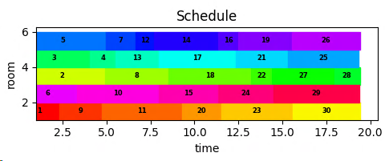

We already looked at a simple scheduling problem: [Task Scheduling](../scheduling).

Here we are looking at a more elaborated scheduling example with limited resources for tasks with various durations.
We want to get insights by re-engineering the solution of [^1] with [Pyomo](http://www.pyomo.org/).

### Problem
- We have $N$ tasks and $M$ facilities to execute the tasks. 
- Every task has a due date. 
- Tasks require certain resources for execution, e.g. water, electricity, ... 
- Every facility provides a set of resources
- Only one task per resource can be executed at a given time.

Assign the tasks to the facilities so that the task get all required resources for execution. 
We want to minimize the total time to complete all tasks. This time is called *makespan*.

One challenge is the no-overlap constraint for tasks. We will make use of our meanwhile well-known
datastructure. It encodes business logic for formulating the non-overlap constraint.
If you need a primer on this important concept, please refer to [^2].

For experimentation I am using sample data from [^1] in order to have a result benchmark.
We have 30 tasks:

    'resource_usage': {
        1: [0, 0, 0, 0, 0],
            ...
        9: [0, 1, 0, 1, 0],
        29: [0, 0, 0, 0, 0],
            ...
        30: [0, 0, 0, 0, 0],
    }
    
There are 5 facilities and 5 different resource types. Note that some tasks don't need special resources (e.g. task1). 

    'resource_availability': {
        1: [0, 1, 1, 1, 1],
        2: [0, 0, 1, 1, 0],
        3: [0, 0, 0, 1, 1],
        4: [1, 1, 1, 0, 1],
        5: [1, 0, 1, 1, 1],
    }

Note that some tasks don't need special resources (e.g. task1). 
They can execute in any facility. Some jobs require resources that allow only one facility. 
For instance, task9 needs resources 2 and 4. Only facility 1 provides this combination.

## Model

We focus on the better performing approach from [^1]. For comparison of performance of two solution approaches please
check there.

#### Variables

$$
x_{ij} =
\begin{cases}
1, \ \text{ task i is assigned to room j }\\
0, \ \text{ else }\\
\end{cases}\\
\mathit{Makespan} \in R^+\\
\mathit{finish} \in R^+\\
$$

#### Parameters

$$
\mathit{DueDate}_i \ \text{ task du date }\\
length_i, \ \text{ task duration }\\
ok_{ij} =
\begin{cases}
1, \ \text{ task i is allowed in room j }\\
0, \ \text{ else }\\
\end{cases}\\
$$

#### Objective
$$
\min \mathit{Makespan}\\
$$

#### Constraints
The finish time for task $i$ placed in facility $j$ can be calculated as the sum of the 
processing time of all previous jobs assignted to $j$.
We allocate jobs to a facility back-to-back (no holes):
$$
\sum_{i'|i'\le i \land ok(i',j)} length_{i'} x_{i', j}\\
$$

$$
finish_i \ge \sum_{i'|i'\le i \land ok(i',j)} \ length_{i'} x_{i', j} - M(1-x_{i,j}), \ \forall{i,j|ok(i,j)}\\
$$

$$
finish_i \le \mathit{DueDate}_i\\
$$

$$
finish_i \ge 0\\
$$

$$
\sum_{j|ok(i,j)} x_{i,j} = 1, \ \forall i\\
$$

$$
\mathit{Makespan} \ge finish_i\\
$$

$M$ has been set to 100.

## Implementation
By using the bespoke index $ok_{i,j}$ the Pyomo formulation of the constraints are compact:

```python
def all_jobs_assigned_c(model, i):
    return sum(model.x[ii, jj] for (ii, jj) in model.ok if ii == i) == 1
model.all_jobs_assigned_c = Constraint(model.I, rule=all_jobs_assigned_c)

def finish1_c(model, i, j):
    return sum(
        model.length[ii] * model.x[ii, jj] for (ii, jj) in model.ok if jj == j and ii <= i
    ) - M * (1 - model.x[i, j]) <= model.finish[i]
model.finish1_c = Constraint(model.I, model.J, rule=finish1_c)
```

The rest of the model is straightforward. Some effort is only needed for visualization of the result.

## Results

Solving the model with the given parameters is easy:

- Optimal solution: 19.432
- Number of constraints : 240
- Number of variables : 181
- Duration: 00:02:31

            1: [1, 9, 11, 20, 23, 30],
            2: [6, 10, 15, 24, 29],
            3: [2, 8, 18, 22, 27, 28],
            4: [3, 4, 13, 17, 21, 25],
            5: [5, 7, 12, 14, 16, 19, 26]
             
### Visualization



# Summary
We have seen (again) that using bespoke index sets which encode business rules help, expressing constraints and make
models easier to formulate and to solve. 

Calculating these binary datastructures comes down to applying sound software
engineering practice, so they can be tested and debugged with known tools of the trade. This is easier and
less error-prone than trying to find errors in constraint equations.

[^1]: [A scheduling problem](http://yetanothermathprogrammingconsultant.blogspot.com/2020/05/a-scheduling-problem.html)
[^2]: [Another Boring Lockdown Day](../tiling), [Patient Scheduling](../patient_scheduling)

