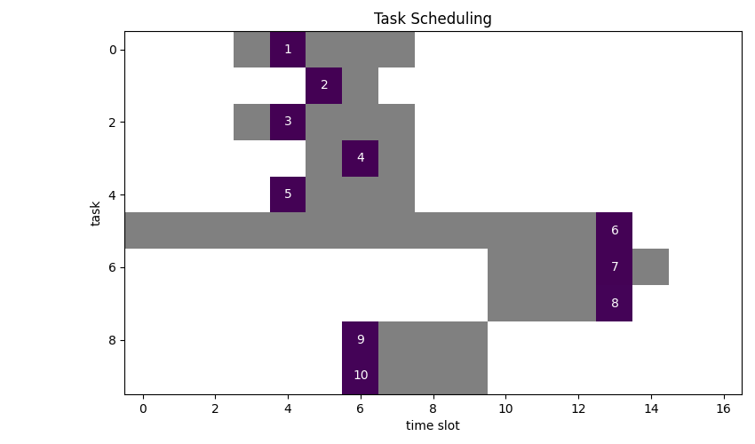

We already looked at a real world scheduling problem: [Patient Scheduling](../patient_scheduling).

Important concepts have been touched there. Here we look at additional aspects of this important
optimization domain, especially in using [Pyomo](http://www.pyomo.org/) as modelling environment.

## Simple Scheduling

### Problem
Schedule 10 tasks. Each task must be assigned to a single time slot, however, not every time slot is viable.
The duration of a task is one timeslot.
We want to minimize the number of timeslots used.

Viable timeslots are marked grey:



We can see, that an optimal solution requires 4 slots.

### Model

#### Variables
$$
x_{i,t} = \begin{cases} 1 & \text{ if job $i$ is assigned to time slot $t$}\\ 0 & \text{ otherwise}\end{cases}
$$
$$
y_t =  \begin{cases} 1 & \text{if time slot $t$ has at least one job assigned to it}\\ 0 & \text{otherwise}\end{cases}
$$

#### Parameters
As we have seen already in several previous articles [^1] we introduce a binary data structure to encode viable task assignments 
into a custom index:

$$
ok_{i,t}=
\begin{cases}
1, \text{ if and only if $(i, t)$ is an allowed assignemnt }\\
0, \text{ else }\\
\end{cases}\\
$$

#### Objective 
$$
\min \sum_t y_t\\ 
$$

#### Constraints
$$
\sum_{t| \mathit{ok}_{i,t}}  x_{i,t} = 1 \forall i \\ 
\sum_{i| \mathit{ok}_{i,t}} x_{i,t} \le N \forall t \\ 
y_t \ge x_{i,t} \forall i,t|\mathit{ok}_{i,t}\\ 
x_{i,t}, y_t \in \{0,1\}
$$

## Results

Now what if we want to scale the problem to a more realistic size? 

Let's generate some sample data:
100 task, 100 timeslots, capacity per timeslot is three.

- $ok_{i,t}$ index created with total number of viable slots: 626
- Optimum: 34 (number of used timeslots)
- Number of constraints : 823
- Number of variables : 10100
- Duration: 00:00:01


Scaling up to 200x200 results in erratic solution times with CBC between 10s and hours.

Here I got a solution after 9s.
- $ok_{i,t}$ index created with total number of viable slots: 1303
- Optimum: 67 (number of used timeslots)
- Number of constraints : 1706
- Number of variables : 40200
- Duration: 00:00:09

It seems that the number of viable slots has a significant effect on solution times. The higher the number, the
faster the solver. Since the configuration of the timeslots determine the complexity of the system this is to
be expected.

In comparison with GAMS YAMPC[^2] mentioned
explicitly the value of having data and results viewing capability out of the box in contrast to using e.g. Pulp.

> When developing and debugging models, often under pressure, life without easy data viewing is just more complicated than it should be.

This it very true. However, it is only modestly complicated to load the [Pyomo](http://www.pyomo.org/) result data structure into Pandas dataframes.
After that you are good to go with the entire Panda's ecosystem. Just cast the boilerplate logic into a template and you almost
never need  additional brain cycles and context switches to view data at will.

A generic solution could be something along these lines:
```python
for var in instance.component_objects(Var, active=True):
    self.result[var.name] = {k: v for (k, v) in var.get_values().items()}

df = pd.DataFrame({k: pd.Series(self.result[var_name]) for var_name in variables})
```

# Summary
We have seen (again) that using bespoke index sets which encode business rules help, expressing constraints and make
models easier to formulate and to solve. 

Calculating these binary datastructures comes down to applying sound software
engineering practice, so they can be tested and debugged with known tools of the trade. This is easier and
less error-prone than trying to find errors in constraint equations.

[^1]: [Another Boring Lockdown Day](../tiling), [Patient Scheduling](../patient_scheduling)
[^2]: [Scheduling: easy MIP](https://yetanothermathprogrammingconsultant.blogspot.com/2018/08/scheduling-easy-mip.html)
