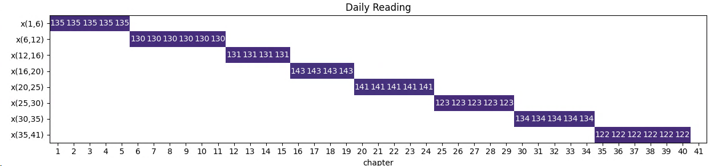

The full version of the problem you can find in [part I of the article](../reading).

## Recap Challenge

1. We want to read the book in a given number of days: 128.  
1. We want to read an integer number of chapters each day (there are more chapters than days), and at least 1 chapter each day.  
1. The chapters are very non uniform in length (some very short, a few very long, many in between) so we would like 
to come up with a reading schedule that minimizes the variance of the length of the days readings 
(read multiple short chapters on the same day, long chapters are the only one read that day).  
1. We want to read through the book in order (no skipping ahead to combine short chapters that are not naturally next to each other)[^1]. 

### Objective: 
We minimize the variance of the number of verses read per day.

## Shortest Path Approach
Interesting enough this problem can be modelled as a directed network graph:
- chapters form the network nodes.
- edges represent transitions from chapter $i$ to chapter $j$, i.e. they correspond reading all chapters from $i$ to $j-1$.
- the graph is directed, so transitions are only allowed from $i \rightarrow j, \ j\ge i$.
- the edges cost is the proportional to the difference from the actual sum of verses per transition from the average.
- to apply flow modelling techniques we need to add a dummy node as network *sink*.
- $ch1$ acts as network *source*.


### Model

Calculate the collection $A$ of edges $(i,j)$ which represent all possible transitions in the network.
$$
A \ \text{ set of edges}\\
(i,j) \in A | j \ge i\\
$$

This is analog to calculating the covering sets in [part 1](../reading). Since the graph is directed
the semantic meaning of the edge definition guarantees that every chapter is being read exacty once.

The same optimization as in the [set covering](../reading) approach can be applied in order to reduce the number of allowed network
edges.
The maximum number of chapters to be read in one day is:
$$
limit = n-T, \\
i, j: 1,..,limit\\
j \ge i\\
$$

Any *'longer'* edges consisting of more chapters would make the number of remaining chapters to be too few to have at least one chapter per
remaining day.


#### Variable
Every edge $(i,j)$ has got a flow $x_{i,j}$ and a cost $c_{i,j}$ associated with it. Since we need to put a constraint
on the number of nodes in the solution we introduce a helper variable $y_i$:

$$
x_{i,j}, \ \text{ flow on edge $(i,j)$}\\
y_i, \ \text{ total flow leaving node $i$ for consumption by other nodes}\\ 
x_{i,j}, y_i \ge 0\\
$$

#### Objective
$$
\min \sum_{(i,j)\in A} c_{i,j} x_{i,j}\\
$$

#### Parameter:
Node Distance:  
The *'distance'* or *'cost coefficient'* for flow $x$ is calculated as
the variance of the sum of verses of selected chapters from the average number of verses per day $\mu$.

$$
c_{i,j} = (\sum_{k=i}^{j-1} v_k - \mu)^2\\
$$

Source and sink flow:  
$$
b_i = 
\begin{cases} 
1, \ \text{ if $i=\mathit{ch1}$}\\  
-1 \ \text{ if $i=\mathit{sink}$}\\  
0 \ \text{ otherwise} 
\end{cases}
$$

#### Constraints

1. classic flow balance constraints
1. enforce the number of nodes being part of the solution, i.e. reading days $T$

Since the total number of reading days $T$ is a parameter, we need to enforce at least $T$ nodes being part of the *shortest path'*
solution. Therefore we split the classic node balance equation:
 
$$
\sum_{(j,i)\in A} x_{j,i} + b_i = y_i \ \forall i\\ 
y_i = \sum_{(i,j)\in A} x_{i,j} \ \forall i\\ 
\sum_i y_i = T \\ 
x_{i,j}, y_i \ge 0 
$$

### Implementation

Since [Pyomo](http://www.pyomo.org/) allows to use regular Python programming language constructs 
like `if..else`, the formulation of boundary conditions which involves trailing or leading time intervals feels very 
natural for a software developer.

Again, the implementation of the constraints is straight forward:
```python
def flow_balance_in_c(model, ii):
    if ii == 1:  # source/chap1
        b = 1
    elif ii == self.N:  # sink/dummy chapter
        b = -1
    else:
        b = 0
    return sum(model.x[j, i] for (j, i) in model.A if i == ii) + b == model.y[ii]

model.flow_balance_in_c = Constraint(
    model.I, rule=flow_balance_in_c
)

model.flow_balance_out_c = Constraint(
    model.I,
    rule=lambda model, ii: sum(model.x[i, j] for (i, j) in model.A if i == ii) == model.y[ii]
)

model.y_c = Constraint(
    rule=lambda model: sum(model.y[i] for i in model.I) == self.T
)
```


### Result
#### 40 Chapters
- Reading time in days: 8
- Number of chapters: 40, max number of chapters per day: 34
- Number of verses: 1059.0
- Average number of verses per day to be read: 132.38

The CBC solver has no problem solving the model and provides an optimal solution in a split second.

Number of constraints : 83  
Number of variables : 833  



The sum of deviations from the average number of verses per day is 47.
We need to read 122 verses on day 8 (minimum) and  143 verses on day 4 (maximum) in order to have the smoothest reading
experience.

#### All Chapters

Reading time in days: 128  
Number of chapters: 240, max number of chapters per day: 113  
Number of verses: 6603.0  
Average number of verses per day to be read: 51.59  
Created sets: 20552, verses: 20552  

In contrast to the model from [the partition set approach](../reading) model building takes only a few
seconds.

Solution [999.828125, 999.828125]  
Number of constraints : 481  
Number of variables : 20792  
Duration: 00:00:01  

For more details regarding the result please refer to [part 1](../reading). The results are
identical (as to be expected).


## Summary
Framing the problem as a network model might be not your first choice of thinking. It certainly wasn't mine.

Choosing the correct abstraction results in dramatic solution performance improvements. The network model seems
to be the best approach by far for this problem. Good to have it in our tool belt now.


[^1]: This is a difference to the approache here: https://yetanothermathprogrammingconsultant.blogspot.com/2018/02/on-scheduling-of-reading-book-chapters.html
[^2]: Optimization Challenge, http://r.789695.n4.nabble.com/optimization-challenge-td1012344.html
