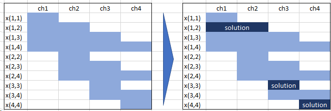
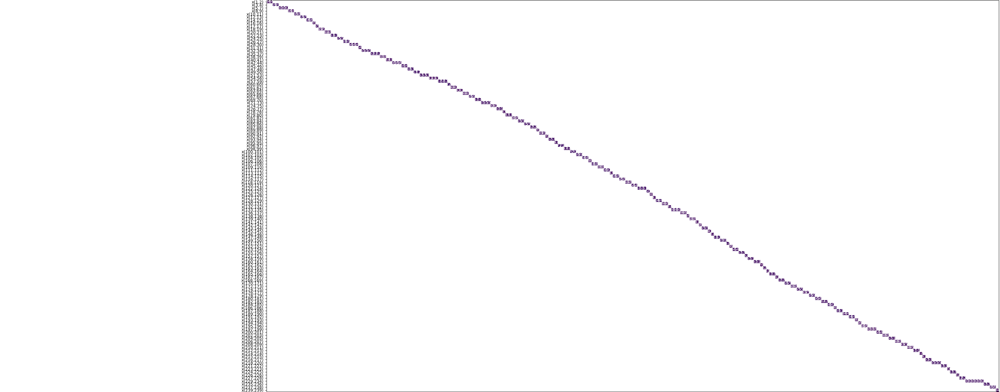

> The Book of Mormon is a sacred text of the Latter Day Saint movement, which, according to adherents, contains writings 
> of ancient prophets who lived on the American continent from approximately 2200 BC to AD 421.[^1]

Not the easiest matter, so we need a smart reading plan.

## Challenge

1. We want to read the book in a given number of days: 128.  
1. We want to read an integer number of chapters each day (there are more chapters than days), and at least 1 chapter each day.  
1. The chapters are very non uniform in length (some very short, a few very long, many in between) so we would like 
to come up with a reading schedule that minimizes the variance of the length of the days readings 
(read multiple short chapters on the same day, long chapters are the only one read that day).  
1. We want to read through the book in order (no skipping ahead to combine short chapters that are not naturally next to each other)[^2]. 

[Yet Another Math Programming Consultant](https://yetanothermathprogrammingconsultant.blogspot.com/2018/02/on-scheduling-of-reading-book-chapters.html) 
analysed various solution approaches. I want to replicate here two of them with [Pyomo](http://www.pyomo.org/) as modelling language.


## Data Set
The entire dataset is listed [here](https://yetanothermathprogrammingconsultant.blogspot.com/2018/02/on-scheduling-of-reading-book-chapters.html).

Number of reading days:  T = 128  
Number of chapters to read: n = 239  
Total number of verses is:
$$
\sum_i v_i = 6603
$$
The average number of verses to be read per day is: 
$$
\mu = \frac{\sum_i v_i}{T}= 51.6
$$

Objective:   
We minimize the variance of the number of verses read per day.

I take *'distance from the average'* as a stand-in for *'variance'*.

## Set Covering Approach

> Consider the universe $U=\{1,2,3,4,5\}$ and the collection of sets $S=\{\{1,2,3\},\{2,4\},\{3,4\},\{4,5\}\}$. 
> Clearly the union of $S$ is $U$. However, we can cover all of the elements with the following, 
> smaller number of sets: $\{\{1,2,3\},\{4,5\}\}$.

We try to cover the set of chapters via sub-sets, so that the chosen sub-sets minimize the distance of the number
of verses to be read per day from the optimal average of 51.6. 
Every chapter is in exactly one sub-set (set partition problem). Chapters are ordered.

The rows are the potential covering sets, which could cover the set of chapters (1-4):



The dark blue sets are a feasible solution for T=3. Note, the sum of dark blue cells per column must be equal one.

### Model
Calculate the collection of sets $(i,j)$ which cover the universe (chapters), i.e. determine the bright blue bars in the
diagram above.
$$
(i,j) \in S | j \ge i\\
$$

The constraint to read at least one chapter per day results in an upper limit for the size of the sets.
The maximum number of chapters to be read in one day is:
$$
limit = n-T, \\
i, j: 1,..,limit\\
j \ge i\\
$$

Any larger covering set would make the number of remaining chapters to be too few to have at least one chapter per
remaining day.

#### Variable
The choice of the variable is the modelling trick, which facilitates a linear model despite the fact, that we
optimize a distance (variance) in the objective.

$$
x_{i,j} = 
\begin{cases} 
1 & \text{if we read chapters $i$ through $j$}\\ 
0 & \text{otherwise} 
\end{cases}
$$

#### Parameter
The cost coefficient for $x$ is calculated as the distance of the sum of verses of selected chapters from the average 
number of verses per day $\mu$.
$$
c_{i,j} = abs(\sum_{k=i}^{j} v_k - \mu)\\
$$

#### Objective
$$
\min \sum_{(i,j)\in S} c_{i,j} x_{i,j}\\
$$

#### Constraints
All chapters are covered:
$$
\sum_{(i \le k \le j)|(i,j)\in S} x_{i,j} = 1 \ \forall k\\ 
$$

We select $T$ rows (days) in the diagram above:
$$
\sum_{(i,j) \in S} x_{i,j} = T\\ 
x_{i,j} \in \{0,1\}
$$

### Implementation
After calculating the potential covering sets $(i,j) \in S$ the formulation of the constraints is very close to the mathematical
model:
```python
model.element_cover_c = Constraint(
    model.K,
    rule=lambda model, k: sum(model.x[i, j] for (i, j) in model.S if i <= k <= j) == 1
)

model.reading_days_c = Constraint(
    rule=lambda model: sum(model.x[i, j] for (i, j) in model.S) == self.T
)
```

[Pyomo](http://www.pyomo.org/) allows for a compact problem formulation.


### Result
The results are surprising. 

The CBC solver has no problem solving the model and provides an optimal solution after 8s. 
The large number of binary variables (20552) does not seem to matter a lot.

However, creating the model and saving the results takes a very long time with [Pyomo](http://www.pyomo.org/). Similar observations have been made by
[others](https://stackoverflow.com/questions/51269351/pyomo-seems-very-slow-to-write-models).

Creating the model:  
Reading time in days: 128  
Number of chapters: 239, max number of chapters per day: 112  
Number of verses: 6603.0  
Average number of verses per day to be read: 51.59  
Created sets: 20552, verses: 20552  

Only after **21 min** (!) the solver started working:  
Solution: [999.828125, 999.828125]  
Number of constraints : 240  
Number of variables : 20552  
Duration: 00:00:08  

If you have any ideas why the creation time is so high or how to improve on it, please let me know!

Here the attempt to visualize the solution, but be warned: it is a large diagram.


The largest deviation from the mean (51.6) is: 26.  
The smallest number of verses per day is 26, the largest 77.

So everyday we will be reading between 26 and 77 verses to finish the book in 128 days while having the smoothest
reading experience.

[YAMC](https://yetanothermathprogrammingconsultant.blogspot.com/2018/02/on-scheduling-of-reading-book-chapters.html) 
has found a better solution as his minimum day has 36 reading verses. This might be due to the fact that he
is using a variance-based cost coefficient metric instead of a distance-based. Closer examination is warranted.

Update 13.06.2020:  
With also using a variance-based cost coefficient metric I get the same results as 
YAMC (Objective: 11241.05469). However, there is a typo in YAMC's formula. The correct notation is:
$$
c_{i,j} = (\sum_{k=i}^{j-1} v_k - \mu)^2\\
$$

## Summary
The clever choice of the variable linearizes this distance/variance problem. It allows to address it with a 
traditional linear set covering approach. 

Translating the real world problem into one of the standard MIP model domains always is the most difficult part of
solving. Once this is accomplished the rest is just implementation detail. Experience is key!

In an upcoming article I will address this problem with another standard MIP model domain: Shortest path optimization.

So now we can start reading the Book of Mormons in an optimal manner.


[^1]: https://en.wikipedia.org/wiki/Book_of_Mormon
[^2]: Optimization Challenge, http://r.789695.n4.nabble.com/optimization-challenge-td1012344.html
